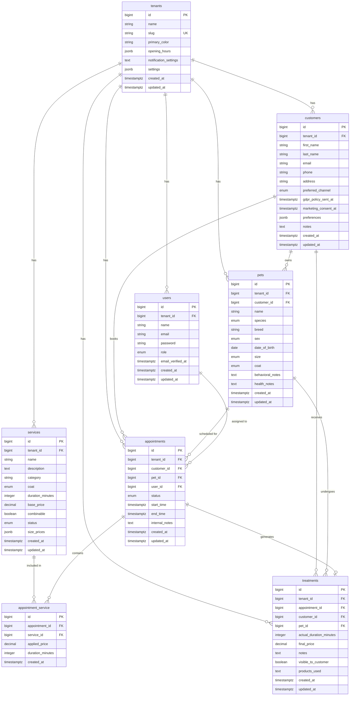

# PawDesk — Data Model Document

> **Versione**: 1.4
> **Data**: 24 Aprile 2026
> **Status**: Draft
> **Database**: SQLite 3.x (MVP) → PostgreSQL 16.x (SaaS)

---

## 1. Executive Summary

Questo documento definisce lo schema database completo per PawDesk, un gestionale multi-tenancy per saloni di toelettatura.

**Strategia database**: SQLite per l'MVP (singolo salone pilota, zero ops), migrazione a PostgreSQL nella fase SaaS (multi-tenant, concorrenza, funzionalità avanzate). Le Laravel migrations sono scritte per essere DB-agnostic dove possibile; le sezioni PostgreSQL-specifiche sono marcate con badge **[SaaS]**.

Il design segue best practices applicabili a entrambi i database:
- **Primary Keys**: `BIGINT AUTOINCREMENT` / `BIGINT GENERATED ALWAYS AS IDENTITY` (evito UUIDv4 per ridurre frammentazione)
- **Multi-tenancy**: Single database con `tenant_id` su tutte le tabelle (global scope)
- **Data Types**: `TEXT`, `JSON`, `TIMESTAMP`, `BIGINT`, `CHECK constraints`
- **Indicizzazione**: Strategia ottimizzata per pattern di query multi-tenancy
- **Foreign Keys**: Sempre indicati, con `ON DELETE CASCADE/SET NULL` espliciti

---

## 2. Overview Schema



### 2.1 Enum Values

**role**: `admin`, `staff`

**preferred_channel**: `email`, `whatsapp`, `sms`

**species**: `dog`, `cat`, `other`

**sex**: `M`, `F`, `unknown`

**size**: `toy`, `piccolo`, `medio`, `grande`, `gigante`

**coat** (pets & services): `raso`, `corto`, `frangiato`, `frangiato_spaniel`, `primitivo`, `da_muta`, `riccio`, `liscio`, `pelo_lungo`, `pelo_corto`

**status** (services): `active`, `archived`

**status** (appointments): `requested`, `confirmed`, `in_progress`, `completed`, `cancelled`, `no_show`

---

## 3. Table Definitions

### 3.1 Table: tenants

**Description**: Represents a single salon/tenant (multi-tenancy)

```sql
CREATE TABLE tenants (
    id BIGINT GENERATED ALWAYS AS IDENTITY PRIMARY KEY,
    name TEXT NOT NULL,
    slug TEXT NOT NULL UNIQUE,
    primary_color TEXT, -- Validazione formato #RRGGBB a livello applicativo
    opening_hours JSONB NOT NULL DEFAULT '{}',
    notification_settings TEXT, -- Encrypted via Laravel cast, non JSON (contenuto cifrato)
    settings JSONB NOT NULL DEFAULT '{}',
    created_at TIMESTAMPTZ NOT NULL DEFAULT NOW(),
    updated_at TIMESTAMPTZ NOT NULL DEFAULT NOW()
);

-- Index for slug lookup (used in public portal)
CREATE INDEX tenants_slug_idx ON tenants (slug);

-- Index for admin management
CREATE INDEX tenants_created_at_idx ON tenants (created_at DESC);
```

**`opening_hours` JSONB structure** (spatie/opening-hours format):
```json
{
  "monday": [["09:00", "18:00"]],
  "tuesday": [["09:00", "18:00"]],
  "wednesday": [["09:00", "18:00"]],
  "thursday": [["09:00", "18:00"]],
  "friday": [["09:00", "18:00"]],
  "saturday": [["09:00", "13:00"]],
  "sunday": []
}
```

**`settings` JSONB structure** (slot configuration):
```json
{
  "slot_duration_minutes": 30,
  "buffer_minutes": 15
}
```

**`notification_settings` structure** (TEXT column, encrypted via Laravel cast):
Il campo è `TEXT` (non JSON) perché il contenuto viene cifrato da Laravel — il database vede una stringa opaca. La struttura JSON sottostante è:
```json
{
  "mailgun_api_key": "key-xxxxxxxxxxxx",
  "mailgun_domain": "mg.nomesalone.pawdesk.app",
  "vonage_api_key": "xxxxxxxx",
  "vonage_api_secret": "xxxxxxxxxxxx",
  "sms_sender_id": "PawDesk"
}
```

**⚠️ Security**: This field is encrypted using Laravel's `encrypted` cast:
```php
// app/Models/Tenant.php
class Tenant extends Model
{
    protected $casts = [
        'notification_settings' => 'encrypted', // Automatic encrypt/decrypt
        'opening_hours' => 'array',
        'settings' => 'array',
    ];
}
```

### 3.2 Table: users

**Description**: System users (groomers/admins)

```sql
CREATE TABLE users (
    id BIGINT GENERATED ALWAYS AS IDENTITY PRIMARY KEY,
    tenant_id BIGINT NOT NULL REFERENCES tenants(id) ON DELETE CASCADE,
    name TEXT NOT NULL,
    email TEXT NOT NULL,
    password TEXT NOT NULL,
    role TEXT NOT NULL CHECK (role IN ('admin', 'staff')),
    email_verified_at TIMESTAMPTZ,
    remember_token TEXT,
    created_at TIMESTAMPTZ NOT NULL DEFAULT NOW(),
    updated_at TIMESTAMPTZ NOT NULL DEFAULT NOW()
);

-- Composite index for authentication queries (tenant + email)
CREATE INDEX users_tenant_email_idx ON users (tenant_id, email);

-- Index for user list by tenant
CREATE INDEX users_tenant_role_idx ON users (tenant_id, role);
```

### 3.3 Table: customers

**Description**: Customer records (pet owners)

```sql
CREATE TABLE customers (
    id BIGINT GENERATED ALWAYS AS IDENTITY PRIMARY KEY,
    tenant_id BIGINT NOT NULL REFERENCES tenants(id) ON DELETE CASCADE,
    first_name TEXT NOT NULL,
    last_name TEXT NOT NULL,
    email TEXT NOT NULL,
    phone TEXT NOT NULL,
    address TEXT,
    preferred_channel TEXT NOT NULL CHECK (preferred_channel IN ('email', 'whatsapp', 'sms')) DEFAULT 'email',
    gdpr_policy_sent_at TIMESTAMPTZ,        -- NULL finché l'informativa non è stata effettivamente inviata
    marketing_consent_at TIMESTAMPTZ,        -- NULL se il cliente non ha acconsentito al marketing
    preferences JSONB NOT NULL DEFAULT '{}', -- Metadati e preferenze (versione informativa, opzioni reminder, ecc.)
    notes TEXT,
    created_at TIMESTAMPTZ NOT NULL DEFAULT NOW(),
    updated_at TIMESTAMPTZ NOT NULL DEFAULT NOW(),
    UNIQUE (tenant_id, email)
);

-- Composite index for full-text search and lookup
CREATE INDEX customers_tenant_email_idx ON customers (tenant_id, email);

-- Index for first_name/last_name search
CREATE INDEX customers_tenant_first_name_idx ON customers (tenant_id, first_name);
CREATE INDEX customers_tenant_last_name_idx ON customers (tenant_id, last_name);

-- Index for re-engagement campaigns (inactive customers)
CREATE INDEX customers_tenant_created_at_idx ON customers (tenant_id, created_at DESC);

-- Index for marketing consent (batch campaigns)
CREATE INDEX customers_tenant_marketing_idx ON customers (tenant_id, marketing_consent_at);
```

**`preferences` JSONB structure**:
```json
{
  "gdpr_policy_version": "1.0"
}
```

Campi previsti per il futuro (non presenti di default, aggiunti su necessità):
- `"marketing_consent_version"` — versione dell'informativa marketing accettata
- `"reminder_hours_before"` — ore prima dell'appuntamento per il reminder (default: 24)
- `"quiet_hours_start"` / `"quiet_hours_end"` — fascia oraria in cui non inviare comunicazioni
- `"language"` — lingua preferita per le comunicazioni
- `"do_not_contact"` — flag per disiscrizione totale

### 3.4 Table: pets

**Description**: Pet records associated with customers

```sql
CREATE TABLE pets (
    id BIGINT GENERATED ALWAYS AS IDENTITY PRIMARY KEY,
    tenant_id BIGINT NOT NULL REFERENCES tenants(id) ON DELETE CASCADE,
    customer_id BIGINT NOT NULL REFERENCES customers(id) ON DELETE CASCADE,
    name TEXT NOT NULL,
    species TEXT NOT NULL CHECK (species IN ('dog', 'cat', 'other')),
    breed TEXT,
    sex TEXT CHECK (sex IN ('M', 'F', 'unknown')),
    date_of_birth DATE,
    size TEXT NOT NULL CHECK (size IN ('toy', 'piccolo', 'medio', 'grande', 'gigante')),
    coat TEXT CHECK (coat IN ('raso', 'corto', 'frangiato', 'frangiato_spaniel', 'primitivo', 'da_muta', 'riccio', 'liscio', 'pelo_lungo', 'pelo_corto')),
    behavioral_notes TEXT,
    health_notes TEXT,
    created_at TIMESTAMPTZ NOT NULL DEFAULT NOW(),
    updated_at TIMESTAMPTZ NOT NULL DEFAULT NOW()
);

-- Composite index for customer + pets lookup
CREATE INDEX pets_tenant_customer_idx ON pets (tenant_id, customer_id);

-- Index for pet name search
CREATE INDEX pets_tenant_name_idx ON pets (tenant_id, name);
```

### 3.5 Table: services

**Description**: Service catalog with size-based pricing

```sql
CREATE TABLE services (
    id BIGINT GENERATED ALWAYS AS IDENTITY PRIMARY KEY,
    tenant_id BIGINT NOT NULL REFERENCES tenants(id) ON DELETE CASCADE,
    name TEXT NOT NULL,
    description TEXT,
    category TEXT NOT NULL,
    coat TEXT CHECK (coat IN ('raso', 'corto', 'frangiato', 'frangiato_spaniel', 'primitivo', 'da_muta', 'riccio', 'liscio', 'pelo_lungo', 'pelo_corto')),
    duration_minutes INTEGER NOT NULL CHECK (duration_minutes > 0),
    base_price DECIMAL(8,2) NOT NULL CHECK (base_price >= 0),
    combinable BOOLEAN NOT NULL DEFAULT true,
    status TEXT NOT NULL CHECK (status IN ('active', 'archived')) DEFAULT 'active',
    size_prices JSONB NOT NULL DEFAULT '{}',
    created_at TIMESTAMPTZ NOT NULL DEFAULT NOW(),
    updated_at TIMESTAMPTZ NOT NULL DEFAULT NOW()
);

-- Composite index for active services list
CREATE INDEX services_tenant_status_idx ON services (tenant_id, status);

-- Index for category search
CREATE INDEX services_tenant_category_idx ON services (tenant_id, category);

-- Index for coat-based service filtering
CREATE INDEX services_tenant_coat_idx ON services (tenant_id, coat);
```

**`coat` column**:
- Specifica il tipo di pelo a cui il servizio è destinato (es. `'riccio'` per un servizio di tosatura per cani a pelo riccio).
- `NULL` per servizi indipendenti dal tipo di pelo (es. taglio unghie, pulizia dentale, shampoo dermatologico).
- Quando un servizio si applica a più tipi di pelo (es. "ricci e lisci"), creare record separati con lo stesso prezzo per ogni tipo di pelo.

**`size_prices` JSONB structure**:
```json
{
  "toy": 20.00,
  "piccolo": 25.00,
  "medio": 35.00,
  "grande": 45.00,
  "gigante": 70.00
}
```

### 3.6 Table: appointments

**Description**: Appointment management

```sql
CREATE TABLE appointments (
    id BIGINT GENERATED ALWAYS AS IDENTITY PRIMARY KEY,
    tenant_id BIGINT NOT NULL REFERENCES tenants(id) ON DELETE CASCADE,
    customer_id BIGINT NOT NULL REFERENCES customers(id) ON DELETE CASCADE,
    pet_id BIGINT NOT NULL REFERENCES pets(id) ON DELETE CASCADE,
    user_id BIGINT REFERENCES users(id) ON DELETE SET NULL,
    status TEXT NOT NULL CHECK (status IN ('requested', 'confirmed', 'in_progress', 'completed', 'cancelled', 'no_show')) DEFAULT 'requested',
    start_time TIMESTAMPTZ NOT NULL,
    end_time TIMESTAMPTZ NOT NULL,
    internal_notes TEXT,
    created_at TIMESTAMPTZ NOT NULL DEFAULT NOW(),
    updated_at TIMESTAMPTZ NOT NULL DEFAULT NOW()
);

-- CRITICAL composite index for calendar queries (tenant + date range + status)
CREATE INDEX appointments_tenant_start_idx ON appointments (tenant_id, start_time DESC, end_time DESC);

-- Index for customer lookup
CREATE INDEX appointments_tenant_customer_idx ON appointments (tenant_id, customer_id);

-- Index for groomer lookup
CREATE INDEX appointments_tenant_user_idx ON appointments (tenant_id, user_id);

-- **[SaaS] Partial indexes** — Non supportati in SQLite.
-- In MVP: i composite indexes sopra sono sufficienti per il volume di un singolo salone.
-- Aggiungere questi partial indexes nella migrazione a PostgreSQL.
-- CREATE INDEX appointments_active_idx ON appointments (tenant_id, start_time)
--     WHERE status IN ('requested', 'confirmed', 'in_progress');
-- CREATE INDEX appointments_completed_idx ON appointments (tenant_id, start_time DESC)
--     WHERE status = 'completed';
```

### 3.7 Table: appointment_service (pivot)

**Description**: Pivot table for multiple services → appointment association

```sql
CREATE TABLE appointment_service (
    id BIGINT GENERATED ALWAYS AS IDENTITY PRIMARY KEY,
    appointment_id BIGINT NOT NULL REFERENCES appointments(id) ON DELETE CASCADE,
    service_id BIGINT NOT NULL REFERENCES services(id) ON DELETE CASCADE,
    applied_price DECIMAL(8,2) NOT NULL CHECK (applied_price >= 0),
    duration_minutes INTEGER NOT NULL CHECK (duration_minutes > 0),
    created_at TIMESTAMPTZ NOT NULL DEFAULT NOW()
);

-- Index for appointment services lookup
CREATE INDEX appointment_service_appointment_idx ON appointment_service (appointment_id);

-- Index for analytics (most requested services)
CREATE INDEX appointment_service_service_idx ON appointment_service (service_id);
```

### 3.8 Table: treatments

**Description**: Treatment history generated from completed appointments

```sql
CREATE TABLE treatments (
    id BIGINT GENERATED ALWAYS AS IDENTITY PRIMARY KEY,
    tenant_id BIGINT NOT NULL REFERENCES tenants(id) ON DELETE CASCADE,
    appointment_id BIGINT NOT NULL REFERENCES appointments(id) ON DELETE CASCADE,
    customer_id BIGINT NOT NULL REFERENCES customers(id) ON DELETE CASCADE,
    pet_id BIGINT NOT NULL REFERENCES pets(id) ON DELETE CASCADE,
    actual_duration_minutes INTEGER NOT NULL CHECK (actual_duration_minutes > 0),
    final_price DECIMAL(8,2) NOT NULL CHECK (final_price >= 0),
    notes TEXT,
    visible_to_customer BOOLEAN NOT NULL DEFAULT true,
    products_used TEXT,
    created_at TIMESTAMPTZ NOT NULL DEFAULT NOW(),
    updated_at TIMESTAMPTZ NOT NULL DEFAULT NOW()
);

-- Composite index for pet history
CREATE INDEX treatments_tenant_pet_idx ON treatments (tenant_id, pet_id, created_at DESC);

-- Index for reporting
CREATE INDEX treatments_tenant_created_at_idx ON treatments (tenant_id, created_at DESC);

-- Index for customer lookup
CREATE INDEX treatments_tenant_customer_idx ON treatments (tenant_id, customer_id);
```

---

## 4. Indexing Strategy

### 4.1 Core Principles

Following best practices (applicabili a SQLite e PostgreSQL):

1. **All FKs are indexed** — Nessun database auto-crea indexes su FK columns
2. **Composite indexes for multi-tenancy** — Always `(tenant_id, column)` for query isolation
3. **Equality first, then range** — In composite indexes: equality column first, range after
4. **Partial indexes for frequent subsets** — Solo PostgreSQL (**[SaaS]**), riducono dimensione indice per query frequenti
5. **Covering indexes for hot read paths** — Consider for most frequent queries

### 4.2 Critical Indexes (Priority Order)

#### Priority 1: Core Performance (CRITICAL for MVP)

```sql
-- 1. Appointments calendar (most frequent query)
-- Pattern: WHERE tenant_id = ? AND start_time BETWEEN ? AND ? AND status IN (...)
-- Already defined: appointments_tenant_start_idx

-- 2. Customer lookup by email (portal authentication)
-- Pattern: WHERE tenant_id = ? AND email = ?
-- Already defined: customers_tenant_email_idx

-- 3. Pets by customer (booking dropdown)
-- Pattern: WHERE tenant_id = ? AND customer_id = ?
-- Already defined: pets_tenant_customer_idx

-- 4. Active appointments (today's dashboard) [SaaS: partial index]
-- Pattern: WHERE tenant_id = ? AND status IN ('requested', 'confirmed', 'in_progress') AND DATE(start_time) = ?
-- MVP: uses composite index appointments_tenant_start_idx (sufficient for single salon volume)
-- SaaS: appointments_active_idx (partial, defined in section 3.6)
```

#### Priority 2: Analytics & Reporting

```sql
-- 5. Pet treatment history (timeline)
-- Pattern: WHERE tenant_id = ? AND pet_id = ? ORDER BY created_at DESC
-- Already defined: treatments_tenant_pet_idx

-- 6. Completed appointments report
-- Pattern: WHERE tenant_id = ? AND status = 'completed' AND start_time BETWEEN ? AND ?
-- Already defined: appointments_completed_idx (partial)

-- 7. Inactive customers (re-engagement)
-- Pattern: WHERE tenant_id = ? AND created_at < ? ORDER BY created_at ASC
-- Already defined: customers_tenant_created_at_idx

-- 8. Most requested services
-- Pattern: JOIN appointment_service WHERE service_id = ? COUNT(*)
-- Already defined: appointment_service_service_idx
```

#### Priority 3: Operational Management

```sql
-- 9. Tenant lookup by slug (public portal)
-- Already defined: tenants_slug_idx

-- 10. Groomer lookup for assignment
-- Pattern: WHERE tenant_id = ? AND role = 'staff'
-- Already defined: users_tenant_role_idx
```

### 4.3 GIN Indexes for JSONB **[SaaS]**

For queries on JSONB fields (`opening_hours`, `notification_settings`, `size_prices`):

```sql
-- GIN index for opening_hours (if needed for complex queries)
CREATE INDEX tenants_opening_hours_idx ON tenants USING GIN (opening_hours);

-- GIN index for size_prices (if needed for price range queries)
CREATE INDEX services_size_prices_idx ON services USING GIN (size_prices);
```

**Note**: GIN indexes sono disponibili solo con PostgreSQL. In MVP (SQLite) non sono necessari: le query su JSON usano `json_extract()` e il volume dati è basso. Aggiungere nella migrazione a PostgreSQL.

### 4.4 Query Pattern Analysis

Most frequent queries and their optimizations:

| Query | Pattern | Index used | Performance |
|-------|---------|------------|-------------|
| Calendar day view | `WHERE tenant_id AND date_range` | `appointments_tenant_start_idx` | O(log n) |
| Customer pets list | `WHERE tenant_id AND customer_id` | `pets_tenant_customer_idx` | O(log n) |
| Today's appointments | `WHERE tenant_id AND active_statuses AND today` | `appointments_active_idx` (partial) | O(log n) + filter |
| Portal authentication | `WHERE tenant_id AND email` | `customers_tenant_email_idx` (unique) | O(log n) |
| Pet history | `WHERE tenant_id AND pet_id ORDER BY created_at` | `treatments_tenant_pet_idx` | O(log n) + sort |
| Customer re-engagement | `WHERE tenant_id AND created_at < X` | `customers_tenant_created_at_idx` | O(log n) + scan |

---

## 5. Laravel Migrations

### 5.1 Tenants Migration

```php
<?php

use Illuminate\Database\Migrations\Migration;
use Illuminate\Database\Schema\Blueprint;
use Illuminate\Support\Facades\Schema;

return new class extends Migration
{
    public function up(): void
    {
        Schema::create('tenants', function (Blueprint $table) {
            $table->id();
            $table->string('name');
            $table->string('slug')->unique();
            $table->string('primary_color', 7)->nullable(); // Validazione formato #RRGGBB a livello applicativo
            $table->json('opening_hours')->default('{}');
            $table->text('notification_settings'); // Encrypted via Laravel cast
            $table->json('settings')->default('{}');
            $table->timestamp('created_at', precision: 0)->useCurrent();
            $table->timestamp('updated_at', precision: 0)->useCurrent();

            $table->index('slug');
            $table->index('created_at');
        });
    }

    public function down(): void
    {
        Schema::dropIfExists('tenants');
    }
};
```

### 5.2 Users Migration

```php
<?php

use Illuminate\Database\Migrations\Migration;
use Illuminate\Database\Schema\Blueprint;
use Illuminate\Support\Facades\Schema;

return new class extends Migration
{
    public function up(): void
    {
        Schema::create('users', function (Blueprint $table) {
            $table->id();
            $table->foreignId('tenant_id')->constrained()->cascadeOnDelete();
            $table->string('name');
            $table->string('email');
            $table->string('password');
            $table->string('role')->default('staff');
            $table->timestamp('email_verified_at', precision: 0)->nullable();
            $table->string('remember_token')->nullable();
            $table->timestamp('created_at', precision: 0)->useCurrent();
            $table->timestamp('updated_at', precision: 0)->useCurrent();

            $table->index(['tenant_id', 'email']);
            $table->index(['tenant_id', 'role']);
        });
    }

    public function down(): void
    {
        Schema::dropIfExists('users');
    }
};
```

### 5.3 Customers Migration

```php
<?php

use Illuminate\Database\Migrations\Migration;
use Illuminate\Database\Schema\Blueprint;
use Illuminate\Support\Facades\Schema;

return new class extends Migration
{
    public function up(): void
    {
        Schema::create('customers', function (Blueprint $table) {
            $table->id();
            $table->foreignId('tenant_id')->constrained('tenants')->cascadeOnDelete();
            $table->string('first_name');
            $table->string('last_name');
            $table->string('email');
            $table->string('phone');
            $table->string('address')->nullable();
            $table->string('preferred_channel')->default('email');
            $table->timestamp('gdpr_policy_sent_at', precision: 0)->nullable();
            $table->timestamp('marketing_consent_at', precision: 0)->nullable();
            $table->json('preferences')->default('{}');
            $table->text('notes')->nullable();
            $table->timestamp('created_at', precision: 0)->useCurrent();
            $table->timestamp('updated_at', precision: 0)->useCurrent();

            $table->unique(['tenant_id', 'email']);
            $table->index(['tenant_id', 'email']);
            $table->index(['tenant_id', 'first_name']);
            $table->index(['tenant_id', 'last_name']);
            $table->index(['tenant_id', 'created_at']);
            $table->index(['tenant_id', 'marketing_consent_at']);
        });
    }

    public function down(): void
    {
        Schema::dropIfExists('customers');
    }
};
```

### 5.4 Pets Migration

```php
<?php

use Illuminate\Database\Migrations\Migration;
use Illuminate\Database\Schema\Blueprint;
use Illuminate\Support\Facades\Schema;

return new class extends Migration
{
    public function up(): void
    {
        Schema::create('pets', function (Blueprint $table) {
            $table->id();
            $table->foreignId('tenant_id')->constrained('tenants')->cascadeOnDelete();
            $table->foreignId('customer_id')->constrained('customers')->cascadeOnDelete();
            $table->string('name');
            $table->string('species');
            $table->string('breed')->nullable();
            $table->string('sex')->default('unknown');
            $table->date('date_of_birth')->nullable();
            $table->string('size');
            $table->string('coat')->nullable();
            $table->text('behavioral_notes')->nullable();
            $table->text('health_notes')->nullable();
            $table->timestamp('created_at', precision: 0)->useCurrent();
            $table->timestamp('updated_at', precision: 0)->useCurrent();

            $table->index(['tenant_id', 'customer_id']);
            $table->index(['tenant_id', 'name']);
        });
    }

    public function down(): void
    {
        Schema::dropIfExists('pets');
    }
};
```

### 5.5 Services Migration

```php
<?php

use Illuminate\Database\Migrations\Migration;
use Illuminate\Database\Schema\Blueprint;
use Illuminate\Support\Facades\Schema;

return new class extends Migration
{
    public function up(): void
    {
        Schema::create('services', function (Blueprint $table) {
            $table->id();
            $table->foreignId('tenant_id')->constrained('tenants')->cascadeOnDelete();
            $table->string('name');
            $table->text('description')->nullable();
            $table->string('category');
            $table->string('coat')->nullable();
            $table->integer('duration_minutes');
            $table->decimal('base_price', 8, 2);
            $table->boolean('combinable')->default(true);
            $table->string('status')->default('active');
            $table->json('size_prices')->default('{}');
            $table->timestamp('created_at', precision: 0)->useCurrent();
            $table->timestamp('updated_at', precision: 0)->useCurrent();

            $table->index(['tenant_id', 'status']);
            $table->index(['tenant_id', 'category']);
            $table->index(['tenant_id', 'coat']);
        });
    }

    public function down(): void
    {
        Schema::dropIfExists('services');
    }
};
```

### 5.6 Appointments Migration

```php
<?php

use Illuminate\Database\Migrations\Migration;
use Illuminate\Database\Schema\Blueprint;
use Illuminate\Support\Facades\Schema;

return new class extends Migration
{
    public function up(): void
    {
        Schema::create('appointments', function (Blueprint $table) {
            $table->id();
            $table->foreignId('tenant_id')->constrained('tenants')->cascadeOnDelete();
            $table->foreignId('customer_id')->constrained('customers')->cascadeOnDelete();
            $table->foreignId('pet_id')->constrained('pets')->cascadeOnDelete();
            $table->foreignId('user_id')->nullable()->constrained('users')->nullOnDelete();
            $table->string('status')->default('requested');
            $table->timestamp('start_time', precision: 0);
            $table->timestamp('end_time', precision: 0);
            $table->text('internal_notes')->nullable();
            $table->timestamp('created_at', precision: 0)->useCurrent();
            $table->timestamp('updated_at', precision: 0)->useCurrent();

            $table->index(['tenant_id', 'start_time', 'end_time']);
            $table->index(['tenant_id', 'customer_id']);
            $table->index(['tenant_id', 'user_id']);

            // [SaaS] Partial indexes: aggiungere in migrazione dedicata dopo switch a PostgreSQL
            // DB::statement('CREATE INDEX appointments_active_idx ON appointments (tenant_id, start_time) WHERE status IN (\'requested\', \'confirmed\', \'in_progress\')');
            // DB::statement('CREATE INDEX appointments_completed_idx ON appointments (tenant_id, start_time DESC) WHERE status = \'completed\'');
        });
    }

    public function down(): void
    {
        Schema::dropIfExists('appointments');
    }
};
```

### 5.7 AppointmentService Pivot Migration

```php
<?php

use Illuminate\Database\Migrations\Migration;
use Illuminate\Database\Schema\Blueprint;
use Illuminate\Support\Facades\Schema;

return new class extends Migration
{
    public function up(): void
    {
        Schema::create('appointment_service', function (Blueprint $table) {
            $table->id();
            $table->foreignId('appointment_id')->constrained('appointments')->cascadeOnDelete();
            $table->foreignId('service_id')->constrained('services')->cascadeOnDelete();
            $table->decimal('applied_price', 8, 2);
            $table->integer('duration_minutes');
            $table->timestamp('created_at', precision: 0)->useCurrent();

            $table->index('appointment_id');
            $table->index('service_id');
        });
    }

    public function down(): void
    {
        Schema::dropIfExists('appointment_service');
    }
};
```

### 5.8 Treatments Migration

```php
<?php

use Illuminate\Database\Migrations\Migration;
use Illuminate\Database\Schema\Blueprint;
use Illuminate\Support\Facades\Schema;

return new class extends Migration
{
    public function up(): void
    {
        Schema::create('treatments', function (Blueprint $table) {
            $table->id();
            $table->foreignId('tenant_id')->constrained('tenants')->cascadeOnDelete();
            $table->foreignId('appointment_id')->constrained('appointments')->cascadeOnDelete();
            $table->foreignId('customer_id')->constrained('customers')->cascadeOnDelete();
            $table->foreignId('pet_id')->constrained('pets')->cascadeOnDelete();
            $table->integer('actual_duration_minutes');
            $table->decimal('final_price', 8, 2);
            $table->text('notes')->nullable();
            $table->boolean('visible_to_customer')->default(true);
            $table->text('products_used')->nullable();
            $table->timestamp('created_at', precision: 0)->useCurrent();
            $table->timestamp('updated_at', precision: 0)->useCurrent();

            $table->index(['tenant_id', 'pet_id', 'created_at']);
            $table->index(['tenant_id', 'created_at']);
            $table->index(['tenant_id', 'customer_id']);
        });
    }

    public function down(): void
    {
        Schema::dropIfExists('treatments');
    }
};
```

---

## 5.9 SQLite vs PostgreSQL: Differenze per l'MVP

Le Laravel migrations sopra sono scritte per essere DB-agnostic dove possibile. Questa sezione elenca le differenze pratiche da tenere a mente.

### Funzionalità non disponibili in SQLite

| Feature | PostgreSQL | SQLite (MVP) | Impatto MVP |
|---------|-----------|--------------|-------------|
| Partial indexes | `WHERE status = 'completed'` | Non supportati | Basso: i composite indexes coprono il volume di un singolo salone |
| GIN indexes (JSONB) | `USING GIN (column)` | Non supportati | Nessuno: le query su JSON usano `json_extract()`, volume basso |
| `pg_stat_statements` | Query monitoring | `EXPLAIN QUERY PLAN` | Basso: monitoring non critico per singolo salone |
| `VACUUM ANALYZE` | Maintenance manuale | Automatico | Nessuno |
| Concurrent writes | MVCC, multi-connection | Lock a livello file | Basso: singolo utente + singolo queue worker |

### Compatibilità confermata

| Feature | Stato | Note |
|---------|-------|------|
| Foreign keys | Supportato | Abilitare `DB_FOREIGN_KEYS=true` in `.env` (Laravel default) |
| JSON columns | Supportato | `$table->json()` funziona, usa `json_extract()` internamente |
| Transactions | Supportato | Eloquent transactions funzionano normalmente |
| CHECK constraints | Supportato | Non usati nelle migration; validazione a livello applicativo |
| Composite indexes | Supportato | `$table->index(['col1', 'col2'])` funziona |
| `BIGINT AUTOINCREMENT` | Supportato | `$table->id()` mappa correttamente |
| Queue driver "database" | Supportato | Attenzione: usare singolo worker per evitare lock contention |

### Checklist migrazione a PostgreSQL (Fase 4)

Quando si passa da SQLite a PostgreSQL:

1. Cambiare `DB_CONNECTION=sqlite` → `DB_CONNECTION=pgsql` in `.env`
2. Eseguire una migration dedicata che aggiunge i partial indexes (già documentati nella sezione 3.6)
3. Aggiungere i GIN indexes per JSONB (sezione 4.3)
4. Deployare Docker Compose con PostgreSQL (sezione 6)
5. Migrare i dati esistenti con un dump/restore script
6. Abilitare queue worker multipli (da singolo a multi-process)

---

## 6. Docker Compose Setup PostgreSQL **[SaaS]**

> **Nota**: In MVP si usa SQLite (file-based, zero setup). Questa sezione è riferimento per la fase SaaS quando si migra a PostgreSQL.

### 6.1 docker-compose.yml

```yaml
version: '3.8'

services:
  postgres:
    image: postgres:16-alpine
    container_name: pawdesk-postgres
    restart: unless-stopped
    environment:
      POSTGRES_DB: pawdesk
      POSTGRES_USER: pawdesk
      POSTGRES_PASSWORD: ${DB_PASSWORD:-changeme}
      PGDATA: /var/lib/postgresql/data/pgdata
    ports:
      - "5432:5432"
    volumes:
      - postgres_data:/var/lib/postgresql/data
      - ./docker/postgres/init.sql:/docker-entrypoint-initdb.d/init.sql
    healthcheck:
      test: ["CMD-SHELL", "pg_isready -U pawdesk -d pawdesk"]
      interval: 10s
      timeout: 5s
      retries: 5
    networks:
      - pawdesk-network

volumes:
  postgres_data:
    driver: local

networks:
  pawdesk-network:
    driver: bridge
```

### 6.2 .env (variabili ambiente)

**MVP (SQLite)**:
```bash
DB_CONNECTION=sqlite
# DB_DATABASE è opzionale, default: database/database.sqlite
```

**SaaS (PostgreSQL)**:

```bash
# Database
DB_CONNECTION=pgsql
DB_HOST=127.0.0.1
DB_PORT=5432
DB_DATABASE=pawdesk
DB_USERNAME=pawdesk
DB_PASSWORD=your_secure_password_here
```

### 6.3 docker/postgres/init.sql (ottimizzazioni PostgreSQL)

```sql
-- Ottimizzazioni PostgreSQL per PawDesk MVP

-- Shared buffers: 25% of RAM (es. 1GB per 4GB RAM)
ALTER SYSTEM SET shared_buffers = '1GB';

-- Work mem: per operazioni di sorting/hashing
ALTER SYSTEM SET work_mem = '32MB';

-- Maintenance work mem: per VACUUM, CREATE INDEX
ALTER SYSTEM SET maintenance_work_mem = '256MB';

-- Effective cache size: 50-75% of RAM
ALTER SYSTEM SET effective_cache_size = '2GB';

-- Random page cost: per SSD (default 4.0 è per HDD)
ALTER SYSTEM SET random_page_cost = '1.1';

-- Checkpoint completion target: riduce I/O spike
ALTER SYSTEM SET checkpoint_completion_target = '0.9';

-- WAL settings: bilanciamento tra performance e sicurezza
ALTER SYSTEM SET wal_buffers = '16MB';
ALTER SYSTEM SET min_wal_size = '512MB';
ALTER SYSTEM SET max_wal_size = '2GB';

-- Logging: utile per debugging in sviluppo
ALTER SYSTEM SET log_min_duration_statement = '1000'; -- log query > 1s
ALTER SYSTEM SET log_line_prefix = '%t [%p]: [%l-1] user=%u,db=%d,app=%a,client=%h ';

-- Reload configuration
SELECT pg_reload_conf();
```

### 6.4 Comandi Utili

```bash
# Avvio container
docker-compose up -d

# Log PostgreSQL
docker-compose logs -f postgres

# Accesso shell PostgreSQL
docker-compose exec postgres psql -U pawdesk -d pawdesk

# Backup database
docker-compose exec postgres pg_dump -U pawdesk pawdesk > backup_$(date +%Y%m%d).sql

# Restore database
docker-compose exec -T postgres psql -U pawdesk pawdesk < backup_20260422.sql

# Stop containers
docker-compose down

# Stop e rimuovi volumes (⚠️ attenzione!)
docker-compose down -v
```

---

## 7. Performance Considerations

### 7.1 Query Optimization Tips

1. **Usa sempre `tenant_id` nelle WHERE clause** — Permette al query planner di usare i composite indexes
2. **Evita `SELECT *`** — Specifica solo le colonne necessarie per ridurre I/O
3. **Usa `EXPLAIN ANALYZE`** — Per verificare che gli indici siano usati correttamente
4. **Considera `prepared statements`** — Laravel li usa di default, riduce parsing overhead
5. **Batch inserts** — Per bulk data, usa chunked inserts (es. seeder)

### 7.2 Monitoring Queries

**MVP (SQLite)**: Per il singolo salone pilota, il monitoring non è critico. In caso di necessità:
```sql
-- Explain query plan (equivalente di EXPLAIN ANALYZE)
EXPLAIN QUERY PLAN SELECT * FROM appointments WHERE tenant_id = 1 AND start_time > '2026-01-01';

-- Lista indici
SELECT name, tbl_name FROM sqlite_master WHERE type = 'index';

-- Dimensione database
SELECT page_count * page_size as size FROM pragma_page_count(), pragma_page_size();
```

**SaaS (PostgreSQL)** **[SaaS]**:

```sql
-- Query lente (>1s, configurato in init.sql)
SELECT * FROM pg_stat_statements
ORDER BY mean_exec_time DESC
LIMIT 10;

-- Indici non utilizzati
SELECT schemaname, tablename, indexname, idx_scan
FROM pg_stat_user_indexes
WHERE idx_scan = 0
AND schemaname NOT IN ('pg_catalog', 'information_schema');

-- Dimensione tabelle e indici
SELECT
    schemaname,
    tablename,
    pg_size_pretty(pg_total_relation_size(schemaname||'.'||tablename)) AS size
FROM pg_tables
WHERE schemaname = 'public'
ORDER BY pg_total_relation_size(schemaname||'.'||tablename) DESC;

-- Connessioni attive
SELECT count(*) FROM pg_stat_activity WHERE state = 'active';
```

### 7.3 Maintenance Routine

**MVP (SQLite)**: Non richiede maintenance routine. SQLite esegue automaticamente `VACUUM` e ottimizzazione. Per backup, basta copiare il file `database.sqlite`.

**SaaS (PostgreSQL)** **[SaaS]**:

```bash
# Cron job settimanale per VACUUM ANALYZE
0 2 * * 0 docker-compose exec -T postgres psql -U pawdesk -d pawdesk -c "VACUUM ANALYZE;"
```

---

## 8. Next Steps

1. **Review e approvazione schema** — Convalidare con il team
2. **Creazione migrazioni** — Copiare i file di migrazione nel progetto Laravel
3. **Setup Docker Compose** — Configurare ambiente di sviluppo locale
4. **Test performance** — Eseguire `EXPLAIN ANALYZE` su query critiche
5. **Seed data** — Creare seeder per tenant di test e dati demo
6. **Backup strategy** — Implementare backup automatizzati (pg_dump + cron)

---

**Approvato da**: _________________ **Data**: _________________

**Revisione**:
- v1.0 (22 Apr 2026) - Creazione iniziale con schema completo, indicizzazione e migrazioni Laravel
- v1.1 (24 Apr 2026) - Aggiornamento database: SQLite per MVP, PostgreSQL per SaaS. Sezioni [SaaS] marcate (partial indexes, GIN, Docker Compose, monitoring). Correzione bug ->regex() nella migration tenants. Chiarimento tipo notification_settings. Aggiunta sezione 5.9 differenze SQLite vs PostgreSQL.
- v1.2 (24 Apr 2026) - Ridesign colonne GDPR tabella customers: `gdpr_consent_date` e `gdpr_policy_version` sostituite con `gdpr_policy_sent_at` (nullable, traccia invio effettivo), `marketing_consent_at` (nullable, consenso esplicito promozioni) e `preferences` JSONB (metadati e preferenze, include gdpr_policy_version). Aggiunto indice `customers_tenant_marketing_idx` per campagne marketing.
- v1.3 (24 Apr 2026) - Ridesign taglie e tipo pelo: `size` enum rinominato da `XS/S/M/L/XL` a `toy/piccolo/medio/grande/gigante`. `coat_type` e `coat_length` sostituiti con singolo `coat` enum su tabella pets. Aggiunta colonna `coat` nullable su tabella services per filtraggio servizi per tipo pelo. Chiavi `size_prices` aggiornate alle nuove taglie. Aggiunto indice `services_tenant_coat_idx`.
- v1.4 (25 Apr 2026) - Migliorata portabilità migration Laravel: sostituiti tutti i `$table->enum()` con `$table->string()` (9 occorrenze su 5 migration). Le migration non usano più CHECK constraints a livello DB; la validazione dei valori ammessi è demandata a livello applicativo (Form Request). Sezioni SQL DDL (3.x) invariate. Aggiornata tabella compatibilità sezione 5.9.
