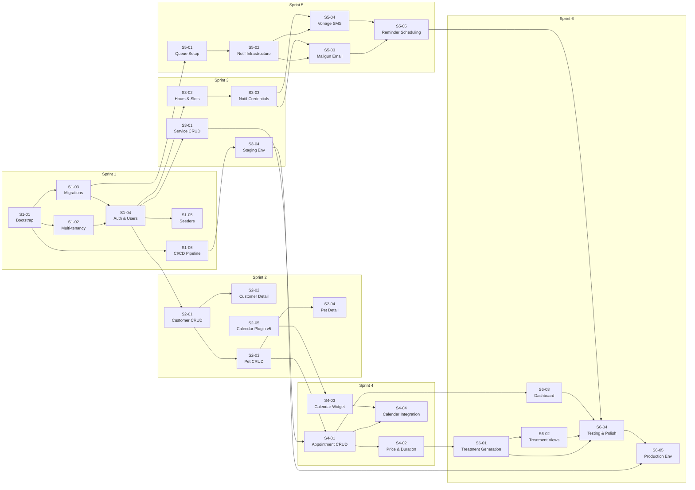

# PawDesk — Fase 1 (MVP): Sprint Backlog

> **Versione**: 2.0
> **Data**: 25 Aprile 2026
> **Status**: Draft
> **Riferimenti**: [PRD v1.6](./product_requirements.md) · [Data Model v1.4](./data_model.md)

---

## 1. Overview

### 1.1 Parametri di Piano

| Parametro | Valore |
|-----------|--------|
| **Durata sprint** | 1 settimana |
| **Numero sprint** | 6 |
| **Durata totale Fase 1** | 6 settimane |
| **Scala story points** | Fibonacci (1, 2, 3, 5, 8, 13) |
| **Totale story points** | ~121 SP |
| **Team** | 1 sviluppatore (self-review con checklist) |

### 1.2 Scope Fase 1 (MVP)

**Incluso**:
- Setup progetto Laravel 13 + Filament 5 con multi-tenancy
- CI/CD pipeline (GitHub Actions): lint, test, deploy automatico su staging
- Ambienti: staging (Dokploy su Hetzner CPX21) + produzione
- Migrazioni database complete (SQLite)
- CRUD completo: Tenant, User, Customer, Pet, Service, Appointment
- Vista calendario via `speniti/filament-calendar` (con aggiornamento compatibilità Filament v5)
- Notifiche email (Mailgun) + SMS (Vonage) con code database driver
- Generazione automatica storico trattamenti
- Dashboard minimale con widget conteggi
- Impostazioni salone: orari, slot, credenziali notifiche

**Escluso** (deferito a fasi successive):
- Foto upload e integrazione Cloudflare R2 → Fase 3
- Portale pubblico prenotazione → Fase 2
- Magic link authentication → Fase 2
- WhatsApp → Fase 2+
- Dashboard completa, grafici, export CSV/PDF → Fase 3
- Branding, logo, colori portale → Fase 2

---

## 2. Sprint Plan Summary

| Sprint | Tema | Story Points | N. Storie |
|--------|------|:------------:|:---------:|
| **1** | Foundation, CI/CD & Setup | 20 | 6 |
| **2** | Customer, Pet & Calendar Plugin | 23 | 5 |
| **3** | Services, Settings & Staging | 18 | 4 |
| **4** | Appointments & Calendar | 21 | 4 |
| **5** | Notifications | 18 | 5 |
| **6** | Treatment, Dashboard, Production & Polish | 21 | 5 |
| | **Totale** | **121** | **29** |

> **Nota**: Sprint 2 è il più carico (23 SP). La storia S2-05 (calendar plugin update) è lavoro su un repository separato e può essere parallelizzata con le storie CRUD.

---

## 3. Sprint Details

### Sprint 1: Foundation, CI/CD & Setup

**Sprint Goal**: Ambiente di sviluppo funzionante con multi-tenancy, autenticazione, database e pipeline CI/CD pronta.

---

#### S1-01: Project Bootstrap

**Descrizione**: Inizializzazione progetto Laravel 13 con Filament 5 e struttura base.

**Acceptance Criteria**:
- [ ] Progetto Laravel 13 creato e funzionante
- [ ] Filament 5 installato e configurato
- [ ] Admin panel accessibile su `/admin`
- [ ] File `.env` configurato per SQLite
- [ ] Repository Git inizializzato con `.gitignore` appropriato
- [ ] Coding standards configurati (Pint)

**Task**:
- [ ] Creare progetto Laravel 13 (`composer create-project`)
- [ ] Installare Filament 5 (`composer require filament/filament:"^5.0"`)
- [ ] Configurare `.env` per SQLite (`DB_CONNECTION=sqlite`)
- [ ] Pubblicare e configurare Filament panel
- [ ] Installare e configurare Laravel Pint
- [ ] Inizializzare repository Git con commit iniziale

**Test**:
- [ ] Unit test: verifica configurazione base (connessione DB, provider registrati)
- [ ] Feature test: homepage e `/admin` rispondono con status 200

**Story Points**: 2
**Dipendenze**: Nessuna

---

#### S1-02: Multi-tenancy & Filament Panel Setup

**Descrizione**: Configurazione multi-tenancy nativa Filament con single database e `tenant_id`.

**Acceptance Criteria**:
- [ ] Model `Tenant` creato con casts configurati (`opening_hours`, `settings` come array, `notification_settings` come encrypted)
- [ ] Filament panel configurato per multi-tenancy nativo
- [ ] Tenant middleware attivo su tutte le rotte panel
- [ ] Global scope `tenant_id` applicato automaticamente a tutti i modelli
- [ ] Risoluzione tenant da sessione/panel context
- [ ] Interfaccia selezione tenant al login (se admin globale) o auto-assegnazione

**Task**:
- [ ] Creare Model `Tenant` con `$casts` e `$fillable`
- [ ] Registrare Tenant model in Filament panel provider
- [ ] Configurare `->tenant(Tenant::class)` nel panel provider
- [ ] Creare trait `BelongsToTenant` con global scope automatico
- [ ] Applicare trait a tutti i modelli tenant-scoped
- [ ] Configurare tenant resolution e middleware

**Test**:
- [ ] Unit test: `BelongsToTenant` trait applica global scope correttamente
- [ ] Feature test: dati di tenant A non sono accessibili dal contesto di tenant B

**Story Points**: 5
**Dipendenze**: S1-01

---

#### S1-03: Database Migrations

**Descrizione**: Creazione tutte le migration dal data model v1.4 usando `$table->string()` al posto di `enum()`.

**Acceptance Criteria**:
- [ ] Tutte le tabelle migrate create: `tenants`, `users`, `customers`, `pets`, `services`, `appointments`, `appointment_service`, `treatments`
- [ ] Tutte le foreign key con `ON DELETE CASCADE/SET NULL` corretti
- [ ] Indici compositi per multi-tenancy `(tenant_id, column)` creati
- [ ] Unique constraint su `(tenant_id, email)` per customers
- [ ] `php artisan migrate` eseguito con successo su SQLite
- [ ] Tutti i modelli Eloquent creati con relazioni e `$casts`

**Task**:
- [ ] Creare migration `create_tenants_table` (da data model §5.1)
- [ ] Creare migration `create_users_table` (da data model §5.2)
- [ ] Creare migration `create_customers_table` (da data model §5.3)
- [ ] Creare migration `create_pets_table` (da data model §5.4)
- [ ] Creare migration `create_services_table` (da data model §5.5)
- [ ] Creare migration `create_appointments_table` (da data model §5.6)
- [ ] Creare migration `create_appointment_service_table` (da data model §5.7)
- [ ] Creare migration `create_treatments_table` (da data model §5.8)
- [ ] Eseguire `php artisan migrate` e verificare
- [ ] Creare tutti i modelli Eloquent con relazioni, `$fillable`, `$casts`

**Test**:
- [ ] Feature test: `php artisan migrate:fresh` esegue senza errori
- [ ] Unit test: ogni modello ha le relazioni corrette definite (belongsTo, hasMany, belongsToMany)

**Story Points**: 3
**Dipendenze**: S1-01

---

#### S1-04: Authentication & User Management

**Descrizione**: Setup autenticazione Filament nativa e CRUD utenti con ruoli (admin/staff).

**Acceptance Criteria**:
- [ ] Login/logout Filament funzionante
- [ ] Model `User` con colonna `role` (string: `admin`, `staff`)
- [ ] Filament `UserResource` con CRUD completo
- [ ] Solo admin può gestire utenti
- [ ] Staff vede solo i propri dati profilo (no gestione utenti)
- [ ] Password hashing automatico
- [ ] Validazione email unica per tenant

**Task**:
- [ ] Configurare Filament auth nativo (no Fortify — sufficiente per MVP)
- [ ] Creare `UserResource` Filament con form e table
- [ ] Implementare validazione role (admin/staff) nel form
- [ ] Configurare policies: solo admin gestisce utenti
- [ ] Creare middleware per role check
- [ ] Configurare password hashing su creazione/modifica

**Test**:
- [ ] Feature test: login con credenziali corrette → accesso panel
- [ ] Feature test: login con credenziali errate → errore
- [ ] Feature test: staff non può accedere a UserResource
- [ ] Unit test: password viene hashata su creazione utente

**Story Points**: 5
**Dipendenze**: S1-02, S1-03

---

#### S1-05: Seeders & Initial Data

**Descrizione**: Seeders per tenant pilota, admin user e dati di test.

**Acceptance Criteria**:
- [ ] `TenantSeeder` crea il salone pilota con orari default
- [ ] `UserSeeder` crea admin user per il tenant pilota
- [ ] `DemoSeeder` crea dati di test (clienti, animali, servizi) per sviluppo
- [ ] `php artisan db:seed` eseguibile e ripetibile (fresh)
- [ ] Dati di test coprono gli scenari principali (animali di taglie/pelo diversi, servizi con prezzi per taglia)

**Task**:
- [ ] Creare `TenantSeeder` con dati salone pilota
- [ ] Creare `UserSeeder` con admin e staff user
- [ ] Creare `DemoSeeder` con clienti, animali, servizi di esempio
- [ ] Verificare `php artisan migrate:fresh --seed` funziona end-to-end

**Test**:
- [ ] Feature test: `migrate:fresh --seed` popola tutte le tabelle con dati attesi
- [ ] Unit test: ogni seeder crea il numero corretto di record

**Story Points**: 2
**Dipendenze**: S1-04

---

#### S1-06: CI/CD Pipeline (GitHub Actions)

**Descrizione**: Pipeline CI/CD su GitHub Actions con lint, test e deploy automatico su staging.

**Acceptance Criteria**:
- [ ] Workflow GitHub Actions configurato su push/PR verso `main`
- [ ] Job lint: esecuzione `./vendor/bin/pint --test`
- [ ] Job test: esecuzione `php artisan test` (PHPUnit)
- [ ] Job deploy-staging: deploy automatico su Dokploy dopo merge su `main`
- [ ] Job deploy-production: deploy manuale (workflow dispatch)
- [ ] Segreti GitHub configurati (Dokploy API token, SSH keys)
- [ ] Pipeline verde su primo commit

**Task**:
- [ ] Creare `.github/workflows/ci.yml` con jobs lint + test
- [ ] Creare `.github/workflows/deploy.yml` con jobs staging + production
- [ ] Configurare environment secrets su GitHub
- [ ] Configurare Dockerfile per build (preparazione per Dokploy)
- [ ] Testare pipeline con push di prova

**Test**:
- [ ] Pipeline fallisce se Pint rileva violazioni
- [ ] Pipeline fallisce se un test PHPUnit fallisce
- [ ] Pipeline completa con successo su codice pulito

**Story Points**: 3
**Dipendenze**: S1-01

---

### Sprint 2: Customer, Pet & Calendar Plugin

**Sprint Goal**: CRUD completo per clienti e animali con relazioni, viste di dettaglio e aggiornamento plugin calendario.

---

#### S2-01: Customer CRUD

**Descrizione**: Filament resource completa per gestione clienti (US1).

**Acceptance Criteria**:
- [ ] `CustomerResource` con lista paginata, ricerca full-text (nome, cognome, email, telefono)
- [ ] Form creazione/edit con: nome, cognome, email, telefono, indirizzo
- [ ] Selezione canale preferito (email/whatsapp/sms) via dropdown
- [ ] Campi GDPR: `gdpr_policy_sent_at` (readonly, aggiornato automaticamente), `marketing_consent_at` (checkbox con timestamp)
- [ ] Campo preferenze JSON (viewer/editor basilare)
- [ ] Campo note libere (textarea, max 1000 caratteri)
- [ ] Validazione email unica per tenant
- [ ] Colonne list view: nome completo, email, telefono, canale preferito, data creazione
- [ ] Filtri: canale preferito, consenso marketing, clienti senza appuntamenti

**Task**:
- [ ] Creare `CustomerResource` Filament
- [ ] Configurare table columns con sorting e search
- [ ] Creare form con tutti i campi e validazione
- [ ] Implementare validazione email unique per tenant
- [ ] Aggiungere filtri e azioni bulk
- [ ] Configurare navigazione nel menu laterale

**Test**:
- [ ] Feature test: CRUD completo cliente (create, read, update, delete)
- [ ] Feature test: email duplicata per stesso tenant → errore validazione
- [ ] Feature test: email duplicata per tenant diverso → permessa
- [ ] Unit test: validazione campi obbligatori e formati

**Story Points**: 5
**Dipendenze**: S1-04

---

#### S2-02: Customer Detail & Relations

**Descrizione**: Vista aggregata cliente con animali collegati, storico appuntamenti e spesa totale.

**Acceptance Criteria**:
- [ ] Vista dettaglio cliente con sezioni: info anagrafiche, animali collegati, appuntamenti recenti
- [ ] Relation Manager per animali collegati (lista inline)
- [ ] Contatore spesa totale (somma treatments.final_price)
- [ ] Contatore appuntamenti totali e per stato
- [ ] Link rapido per creare animale/appuntamento dal dettaglio cliente

**Task**:
- [ ] Creare `ViewCustomer` page con widget informativi
- [ ] Implementare `PetRelationManager` sulla risorsa Customer
- [ ] Aggiungere widget conteggi (stat)
- [ ] Aggiungere azioni rapide per creazione entità correlate

**Test**:
- [ ] Feature test: vista dettaglio cliente accessibile e mostra dati corretti
- [ ] Feature test: relation manager mostra animali collegati

**Story Points**: 3
**Dipendenze**: S2-01

---

#### S2-03: Pet CRUD

**Descrizione**: Filament resource completa per gestione animali (US2, senza foto).

**Acceptance Criteria**:
- [ ] `PetResource` accessibile da menu e da relation manager del cliente
- [ ] Form creazione/edit con: nome, specie (dropdown dog/cat/other), razza, sesso (M/F/unknown), data nascita, taglia (dropdown toy/piccolo/medio/grande/gigante), tipo pelo (dropdown coat values)
- [ ] Campi note comportamentali e sanitarie (textarea)
- [ ] Dropdown animale filtrato per cliente selezionato nel form appuntamento
- [ ] Colonne list view: nome, specie, razza, taglia, proprietario
- [ ] Filtri: specie, taglia, tipo pelo
- [ ] Associazione 1:N cliente→animali visibile e navigabile

**Task**:
- [ ] Creare `PetResource` Filament
- [ ] Definire costanti/enum per specie, taglia, pelo, sesso (validazione applicativa)
- [ ] Configurare form con dropdown e validazione
- [ ] Implementare filtering per cliente (select ajax/livewire)
- [ ] Aggiungere filtri e search alla table

**Test**:
- [ ] Feature test: CRUD completo animale (create, read, update, delete)
- [ ] Feature test: animale associato correttamente a cliente
- [ ] Unit test: validazione valori ammessi (specie, taglia, pelo, sesso)

**Story Points**: 5
**Dipendenze**: S2-01

---

#### S2-04: Pet Detail & Relations

**Descrizione**: Vista dettaglio animale con info proprietario e placeholder storico trattamenti.

**Acceptance Criteria**:
- [ ] Vista dettaglio animale con info complete e link al proprietario
- [ ] Sezione note comportamentali e sanitarie ben evidenziate
- [ ] Taglia e tipo pelo visibili (influenzano prezzo e servizi)
- [ ] Placeholder per "ultimo trattamento" e "prossimo consigliato" (sarà popolato in Sprint 6)
- [ ] Link rapido per creare appuntamento per questo animale

**Task**:
- [ ] Creare `ViewPet` page con layout informativo
- [ ] Aggiungere widget info proprietario
- [ ] Aggiungere placeholder sezione storico trattamenti
- [ ] Aggiungere azione rapida "Nuovo appuntamento"

**Test**:
- [ ] Feature test: vista dettaglio animale accessibile e mostra dati corretti
- [ ] Feature test: link al proprietario funzionante

**Story Points**: 2
**Dipendenze**: S2-03

---

#### S2-05: Calendar Plugin Filament v5 Compatibility

**Descrizione**: Spike di investigazione e aggiornamento di `speniti/filament-calendar` per compatibilità con Filament v5. Lavoro su repository separato.

**Acceptance Criteria**:
- [x] Analisi breaking changes tra Filament v4 e v5 che impattano il plugin
- [x] Plugin aggiornato e compatibile con Filament v5
- [x] Test base funzionanti sul plugin aggiornato (rendering calendario, eventi)
- [x] Tag/versione pubblicata del plugin compatibile con Filament v5
- [x] Documentazione delle API del plugin aggiornata (se necessario)

**Task**:
- [x] Clonare repository `speniti/filament-calendar`
- [x] Analisi dipendenze e breaking changes Filament v5
- [x] Aggiornare codebase del plugin per Filament v5
- [x] Aggiornare test suite del plugin
- [x] Pubblicare release/tag compatibile
- [x] Verificare installabilità via composer nel progetto PawDesk

**Test**:
- [x] Unit test: test suite esistente del plugin passa con Filament v5
- [x] Feature test: rendering calendario in un panel Filament v5 minimale

**Story Points**: 8
**Dipendenze**: Nessuna (repository indipendente — può iniziare in parallelo con S1)

> **Nota**: Questa storia è su un repository separato e può essere sviluppata in parallelo con le storie CRUD del progetto principale.

---

### Sprint 3: Services, Settings & Staging

**Sprint Goal**: Catalogo servizi, configurazione salone e ambiente staging operativo.

---

#### S3-01: Service CRUD & Pricing

**Descrizione**: Filament resource per catalogo servizi con matrice prezzi per taglia (US3).

**Acceptance Criteria**:
- [ ] `ServiceResource` con CRUD completo
- [ ] Form con: nome, descrizione, categoria, tipo pelo destinatario (nullable), durata minuti, prezzo base, flag componibile, stato (active/archived)
- [ ] Editor matrice prezzi per taglia (`size_prices` JSON): override del prezzo base per toy/piccolo/medio/grande/gigante
- [ ] Lista servizi ordinabile per categoria e nome
- [ ] Filtri: categoria, tipo pelo, stato (active/archived)
- [ ] Servizi archiviati non eliminati ma nascosti da dropdown prenotazione
- [ ] Validazione: durata > 0, prezzo base ≥ 0

**Task**:
- [ ] Creare `ServiceResource` Filament
- [ ] Implementare custom field per matrice prezzi per taglia (repeater/key-value)
- [ ] Configurare form con dropdown coat nullable e validazione
- [ ] Implementare soft-status (archived) con filtro default "solo attivi"
- [ ] Configurare ordinamento e raggruppamento per categoria

**Test**:
- [ ] Feature test: CRUD completo servizio (create, read, update, delete)
- [ ] Feature test: archiviazione servizio (non eliminato, nascosto da default filter)
- [ ] Unit test: matrice prezzi per taglia salvata e letta correttamente
- [ ] Unit test: validazione durata > 0 e prezzo ≥ 0

**Story Points**: 5
**Dipendenze**: S1-04

---

#### S3-02: Salon Hours & Slot Settings

**Descrizione**: Pagina impostazioni per orari apertura, durata slot e buffer (US8 parziale).

**Acceptance Criteria**:
- [ ] Pagina settings dedicata nel panel Filament (tenant-scoped)
- [ ] Configurazione orari per giorno della settimana (formato spatie/opening-hours)
- [ ] Giorni di chiusura (checkbox per domenica, range per ferie)
- [ ] Durata slot prenotazione (default 30 min, intero positivo)
- [ ] Buffer tra appuntamenti (default 15 min, intero ≥ 0)
- [ ] Salvataggio su `tenants.opening_hours` e `tenants.settings`
- [ ] Validazione: orari coerenti (inizio < fine), slot > 0

**Task**:
- [ ] Creare Filament Settings page (tenant-scoped)
- [ ] Implementare form orari apertura (repeater per fascia oraria per giorno)
- [ ] Implementare campi durata slot e buffer
- [ ] Validazione form con rules custom
- [ ] Salvataggio su model Tenant

**Test**:
- [ ] Feature test: salvataggio e lettura orari apertura
- [ ] Feature test: salvataggio e lettura durata slot e buffer
- [ ] Unit test: validazione orari (inizio < fine, formato corretto)
- [ ] Unit test: validazione durata slot e buffer (interi positivi)

**Story Points**: 5
**Dipendenze**: S1-04

---

#### S3-03: Notification Credentials Settings

**Descrizione**: Sezione impostazioni per credenziali API notifiche, crittografate nel database.

**Acceptance Criteria**:
- [ ] Sezione nella pagina settings per credenziali Mailgun: API key + dominio
- [ ] Sezione per credenziali Vonage: API key + API secret + SMS sender ID
- [ ] Campi salvati su `tenants.notification_settings` (TEXT, crittografato via Laravel cast `encrypted`)
- [ ] Password/chiavi mascherate nell'interfaccia (tipo password field)
- [ ] Validazione formato base (non vuoti, formato chiave plausibile)
- [ ] Le credenziali non sono visibili nel DB (crittografia attiva)

**Task**:
- [ ] Aggiungere sezione notifiche alla Settings page (S3-02)
- [ ] Creare form fields con type="password" per tutte le credenziali
- [ ] Verificare cast `encrypted` su `notification_settings` nel model Tenant
- [ ] Implementare validazione credenziali
- [ ] Testare salvataggio e lettura (encrypt/decrypt round-trip)

**Test**:
- [ ] Feature test: salvataggio credenziali e verifica round-trip encrypt/decrypt
- [ ] Unit test: valore nel DB è crittografato (non leggibile in chiaro)
- [ ] Feature test: validazione credenziali (campi vuoti rifiutati)

**Story Points**: 3
**Dipendenze**: S3-02

---

#### S3-04: Staging Environment (Dokploy + Hetzner)

**Descrizione**: Setup ambiente staging su Hetzner CPX21 con Dokploy e Dockerfile.

**Acceptance Criteria**:
- [ ] Hetzner VPS CPX21 provisionato e accessibile via SSH
- [ ] Dokploy installato e funzionante sul VPS
- [ ] Applicazione Laravel deployata su Dokploy (staging)
- [ ] Dockerfile ottimizzato per Laravel (Nginx + PHP-FPM 8.4 + SQLite)
- [ ] SSL/TLS configurato via Dokploy (Let's Encrypt)
- [ ] Dominio staging accessibile (es. `staging.pawdesk.peniti.it`)
- [ ] Variabili ambiente configurate (`.env` per staging)
- [ ] CI/CD (S1-06) deploy automatico su merge → staging funzionante
- [ ] Queue worker configurato in Dokploy (singolo processo)

**Task**:
- [ ] Provisionare Hetzner CPX21 e configurare SSH
- [ ] Installare Dokploy sul VPS
- [ ] Creare Dockerfile per Laravel (multi-stage: build + runtime)
- [ ] Configurare applicazione in Dokploy (nome, dominio, env vars)
- [ ] Configurare SSL/TLS con Let's Encrypt via Dokploy
- [ ] Aggiornare workflow GitHub Actions (S1-06) con deploy step Dokploy
- [ ] Configurare queue worker come processo Dokploy
- [ ] Verificare deploy end-to-end: push → CI passa → deploy staging → app accessibile

**Test**:
- [ ] Smoke test: applicazione accessibile su dominio staging
- [ ] Smoke test: login panel funzionante su staging
- [ ] Smoke test: queue worker attivo (`php artisan queue:work`)

**Story Points**: 5
**Dipendenze**: S1-06

---

### Sprint 4: Appointments & Calendar

**Sprint Goal**: Gestione completa appuntamenti con vista calendario e calcolo automatico prezzi/durate.

---

#### S4-01: Appointment CRUD

**Descrizione**: Filament resource per gestione appuntamenti con status workflow (US4 base).

**Acceptance Criteria**:
- [ ] `AppointmentResource` con CRUD completo
- [ ] Form con: cliente (search), animale (dropdown filtrato per cliente selezionato), toelettatore assegnato (dropdown users con role staff), data, ora inizio, servizi (multi-select)
- [ ] Dropdown animale si aggiorna dinamicamente quando cambia il cliente
- [ ] Status workflow: `requested` → `confirmed` → `in_progress` → `completed`, branch `cancelled` / `no_show`
- [ ] Transizioni di stato via azioni Filament (non campo edit libero)
- [ ] Note interne (textarea, visibili solo staff)
- [ ] Validazione: data/ora coerenti, end_time > start_time
- [ ] Colonne list view: data, cliente, animale, toelettatore, status, servizi

**Task**:
- [ ] Creare `AppointmentResource` Filament
- [ ] Implementare form con select dipendenti (cliente → animale)
- [ ] Creare enum/status workflow con transizioni valide
- [ ] Implementare azioni per cambio status (con conferma)
- [ ] Aggiungere validazione form custom
- [ ] Configurare table con colonne e filtri

**Test**:
- [ ] Feature test: CRUD completo appuntamento (create, read, update, delete)
- [ ] Feature test: select animale filtrata per cliente selezionato
- [ ] Unit test: transizioni di stato valide (macchina a stati)
- [ ] Unit test: transizioni di stato non valide rifiutate
- [ ] Feature test: validazione data/ora (end_time > start_time)

**Story Points**: 5
**Dipendenze**: S2-03 (Pet CRUD), S3-01 (Service CRUD)

---

#### S4-02: Appointment Price & Duration Calculation

**Descrizione**: Calcolo automatico durata totale e prezzo basato su servizi selezionati e taglia animale.

**Acceptance Criteria**:
- [ ] Durata totale calcolata automaticamente = somma `duration_minutes` dei servizi selezionati
- [ ] Prezzo calcolato automaticamente = somma prezzi servizi con override taglia (se presente in `size_prices` per la taglia dell'animale, altrimenti `base_price`)
- [ ] Calcolo visibile in tempo reale nel form (before save)
- [ ] Record pivot `appointment_service` creati con `applied_price` e `duration_minutes` per ogni servizio
- [ ] Prezzi e durate "congelati" al momento della creazione (non cambiano se il listino viene aggiornato successivamente)

**Task**:
- [ ] Creare service class `AppointmentPriceCalculator`
- [ ] Implementare logica lookup prezzo: `size_prices[pet.size]` fallback `base_price`
- [ ] Integrare calcolo nel form via Livewire lifecycle hooks
- [ ] Implementare salvataggio pivot `appointment_service` con dati congelati
- [ ] Aggiungere display riepilogo prezzi/durata nel form

**Test**:
- [ ] Unit test: `AppointmentPriceCalculator` con override taglia presente → usa prezzo taglia
- [ ] Unit test: `AppointmentPriceCalculator` con override taglia assente → usa base_price
- [ ] Unit test: `AppointmentPriceCalculator` con servizi multipli → somma corretta
- [ ] Feature test: pivot `appointment_service` salvato con prezzo congelato
- [ ] Feature test: modifica listino dopo creazione appuntamento non aggiorna prezzo congelato

**Story Points**: 5
**Dipendenze**: S4-01

---

#### S4-03: Calendar Widget Integration

**Descrizione**: Integrazione `speniti/filament-calendar` per vista calendario appuntamenti.

**Acceptance Criteria**:
- [ ] Plugin `speniti/filament-calendar` (versione Filament v5 compatibile) installato e configurato
- [ ] Vista calendario giornaliera e settimanale funzionante
- [ ] Appuntamenti visualizzati come eventi nel calendario
- [ ] Colori eventi per stato appuntamento (es. blu=confirmed, verde=in_progress, rosso=cancelled, giallo=requested)
- [ ] Click su evento apre dettaglio appuntamento
- [ ] Navigazione tra giorni/settimane
- [ ] Filtro per toelettatore (se più di uno)

**Task**:
- [ ] Installare plugin `speniti/filament-calendar` (versione aggiornata da S2-05)
- [ ] Configurare data provider per mappare appointments → calendar events
- [ ] Implementare color coding per status
- [ ] Configurare click handler per dettaglio
- [ ] Aggiungere filtro per toelettatore
- [ ] Testare visualizzazione giornaliera e settimanale

**Test**:
- [ ] Feature test: pagina calendario accessibile e renderizza correttamente
- [ ] Feature test: appuntamenti appaiono come eventi nel calendario
- [ ] Feature test: click su evento porta al dettaglio appuntamento

**Story Points**: 8
**Dipendenze**: S1-04, S2-05 (plugin aggiornato)

> **Fallback**: Se il plugin non è pronto, sostituire con widget custom FullCalendar.js (SP: 13).

---

#### S4-04: Calendar ↔ Appointment Integration

**Descrizione**: Creazione e modifica appuntamenti direttamente dal calendario (drag & drop).

**Acceptance Criteria**:
- [ ] Creazione appuntamento cliccando su slot vuoto nel calendario (form precompilato con data/ora)
- [ ] Drag & drop per spostare appuntamento (con conferma)
- [ ] Modifica orario aggiornata su save (start_time e end_time ricalcolati)
- [ ] Verifica disponibilità slot (no overlap con appuntamenti esistenti per lo stesso toelettatore)
- [ ] Blocco slot manuale (ferie, pause) — se supportato dal plugin

**Task**:
- [ ] Implementare handler click su slot vuoto → form creazione
- [ ] Implementare drag & drop con update data/ora
- [ ] Aggiungere validazione overlap slot
- [ ] Aggiungere modale di conferma per spostamento
- [ ] Testare flusso completo create/edit via calendario

**Test**:
- [ ] Feature test: click su slot vuoto apre form con data/ora precompilate
- [ ] Feature test: drag & drop aggiorna orario appuntamento
- [ ] Unit test: validazione overlap slot (rifiuta se conflitto, accetta se libero)

**Story Points**: 3
**Dipendenze**: S4-01, S4-03

---

### Sprint 5: Notifications

**Sprint Goal**: Sistema notifiche multicanale (email + SMS) automatizzato per conferme e reminder.

---

#### S5-01: Queue Infrastructure

**Descrizione**: Setup sistema code Laravel con database driver per processing asincrono notifiche.

**Acceptance Criteria**:
- [ ] Queue table migration creata e eseguita
- [ ] Failed jobs table migration creata e eseguita
- [ ] `QUEUE_CONNECTION=database` configurato in `.env`
- [ ] Queue worker funzionante (`php artisan queue:work`)
- [ ] Job di test eseguito e processato correttamente
- [ ] Singolo worker configurato (limite SQLite: no concorrenza)

**Task**:
- [ ] Creare migration per `jobs` e `failed_jobs` tables
- [ ] Configurare `QUEUE_CONNECTION=database` in `.env`
- [ ] Testare dispatch e processing di un job dummy
- [ ] Documentare comando avvio worker per sviluppo locale

**Test**:
- [ ] Feature test: job dispatchato e processato correttamente
- [ ] Feature test: job fallito registrato nella tabella failed_jobs

**Story Points**: 2
**Dipendenze**: S1-03

---

#### S5-02: Notification Events & Infrastructure

**Descrizione**: Infrastruttura base per notifiche: eventi, dispatching, tracking stato invio.

**Acceptance Criteria**:
- [ ] Notification events definiti per gli eventi del PRD:
  - Richiesta ricevuta
  - Appuntamento confermato
  - Appuntamento cancellato
  - Appuntamento completato
  - Reminder 24h prima
  - Reminder 1h prima
- [ ] Dispatch automatico notifica su cambio stato appuntamento
- [ ] Tracking stato invio per notifica (pending/sent/failed)
- [ ] Rispetto canale preferito del cliente (fallback a email se non specificato)
- [ ] Log fallimenti per retry manuale

**Task**:
- [ ] Creare notification abstract/event classes per i 6 eventi
- [ ] Implementare observer/listener su Appointment status changes
- [ ] Creare tabella `notifications` o meccanismo tracking stato
- [ ] Implementare risoluzione canale preferito cliente
- [ ] Aggiungere logging per failed notifications

**Test**:
- [ ] Unit test: observer dispatcha notifica corretta per ogni transizione di stato
- [ ] Unit test: risoluzione canale preferito (email → email, whatsapp → email fallback, null → email default)
- [ ] Feature test: tracking stato notifica (pending → sent / pending → failed)

**Story Points**: 5
**Dipendenze**: S5-01

---

#### S5-03: Mailgun Email Channel

**Descrizione**: Integrazione Mailgun per invio email di notifica con template e variabili.

**Acceptance Criteria**:
- [ ] Mailgun SDK configurato con credenziali dal tenant (da `notification_settings`)
- [ ] Template email per ogni evento con variabili dinamiche: `{{cliente.nome}}`, `{{animale.nome}}`, `{{data}}`, `{{ora}}`, `{{servizi}}`, `{{salone.nome}}`
- [ ] Email inviata correttamente via queue
- [ ] From address configurabile per tenant
- [ ] Test invio email riuscito (Mailgun sandbox o dominio reale)
- [ ] Gestione errori: cattura eccezioni Mailgun, logga e marca come failed

**Task**:
- [ ] Installare pacchetto Mailgun (`symfony/mailgun-mailer`)
- [ ] Creare Mailgun transport dinamico per-tenant (legge credenziali da Tenant model)
- [ ] Creare blade templates per ogni tipo di notifica email
- [ ] Implementare invio via queue job
- [ ] Aggiungere error handling e logging
- [ ] Testare con dominio Mailgun reale

**Test**:
- [ ] Feature test: email inviata con template corretto e variabili sostituite (con Mailgun mock/fake)
- [ ] Unit test: Mailgun transport dinamico legge credenziali dal tenant corretto
- [ ] Feature test: errore Mailgun → notifica marcata come failed + log

**Story Points**: 5
**Dipendenze**: S5-02, S3-03

---

#### S5-04: Vonage SMS Channel

**Descrizione**: Integrazione Vonage per invio SMS di notifica (stessi eventi email).

**Acceptance Criteria**:
- [ ] Vonage SDK configurato con credenziali dal tenant
- [ ] SMS inviati per gli stessi eventi email (con testo abbreviato)
- [ ] Template SMS con variabili dinamiche (versione compatta)
- [ ] Rispetto limite caratteri SMS (concatenazione se necessario)
- [ ] SMS inviato correttamente via queue
- [ ] Gestione errori: cattura eccezioni Vonage, logga e marca come failed

**Task**:
- [ ] Installare pacchetto Vonage (`vonage/client`)
- [ ] Creare Vonage service class con credenziali per-tenant
- [ ] Creare template SMS per ogni evento (testo breve)
- [ ] Implementare invio via queue job
- [ ] Aggiungere error handling e logging
- [ ] Testare invio SMS reale

**Test**:
- [ ] Feature test: SMS inviato con testo corretto e variabili sostituite (con Vonage mock/fake)
- [ ] Unit test: Vonage service legge credenziali dal tenant corretto
- [ ] Feature test: errore Vonage → notifica marcata come failed + log

**Story Points**: 3
**Dipendenze**: S5-02, S3-03

---

#### S5-05: Reminder Scheduling

**Descrizione**: Scheduler automatico per reminder 24h e 1h prima dell'appuntamento.

**Acceptance Criteria**:
- [ ] Scheduled job che ricerca appuntamenti confermati nelle prossime 24h/1h
- [ ] Invio reminder solo se non già inviato (idempotenza)
- [ ] Laravel scheduler configurato (`php artisan schedule:run`)
- [ ] Cron entry configurata sul server Dokploy
- [ ] Log esecuzione scheduler per verifica

**Task**:
- [ ] Creare console commands `SendReminder24h` e `SendReminder1h`
- [ ] Registrare commands nello scheduler (`app/Console/Kernel.php`)
- [ ] Implementare logica idempotenza (check se reminder già inviato)
- [ ] Configurare cron su Dokploy / documentare setup
- [ ] Testare esecuzione manuale e verificare log

**Test**:
- [ ] Unit test: logica idempotenza (secondo invio stesso reminder → skip)
- [ ] Feature test: comando invia reminder per appuntamenti nelle prossime 24h
- [ ] Feature test: comando non invia reminder per appuntamenti fuori finestra

**Story Points**: 3
**Dipendenze**: S5-03, S5-04

---

### Sprint 6: Treatment, Dashboard, Production & Polish

**Sprint Goal**: Generazione automatica storico trattamenti, dashboard minimale, ambiente produzione e chiusura MVP.

---

#### S6-01: Treatment History Generation

**Descrizione**: Generazione automatica record trattamento alla chiusura appuntamento (US7, senza foto).

**Acceptance Criteria**:
- [ ] Quando appuntamento passa a `completed`, viene generato automaticamente un record in `treatments`
- [ ] Campi prepopolati: servizi eseguiti, durata effettiva (copia da appointment, editabile), prezzo finale (copia, editabile)
- [ ] Campi compilabili post-creazione: note trattamento, prodotti utilizzati, flag visibile al cliente
- [ ] Transazione DB: creazione trattamento + update status atomica
- [ ] Se trattamento già esistente per questo appuntamento, non crearne uno nuovo (idempotenza)

**Task**:
- [ ] Creare observer/listener su transizione status → completed
- [ ] Implementare `TreatmentService::generateFromAppointment()`
- [ ] Creare form di editing post-creazione (note, prodotti, visibilità)
- [ ] Aggiungere protezione idempotenza (unique constraint o check)
- [ ] Testare flusso: crea appointment → completa → verifica trattamento generato

**Test**:
- [ ] Unit test: `TreatmentService::generateFromAppointment()` crea record con dati corretti
- [ ] Unit test: idempotenza — chiamata doppia non crea duplicati
- [ ] Feature test: observer scatena generazione trattamento su transizione → completed
- [ ] Feature test: transazione atomica (fallimento generazione → rollback status change)

**Story Points**: 5
**Dipendenze**: S4-02

---

#### S6-02: Treatment History Views

**Descrizione**: Viste per storico trattamenti nella scheda animale e cliente.

**Acceptance Criteria**:
- [ ] Timeline trattamenti nella scheda animale (S2-04: popola il placeholder)
- [ ] Lista trattamenti nella scheda cliente
- [ ] Vista dettaglio trattamento singolo
- [ ] Edit trattamento (solo note, prodotti, durata effettiva, prezzo finale — non servizi o date)
- [ ] Ordinamento per data (più recente primo)

**Task**:
- [ ] Aggiungere `TreatmentRelationManager` alla risorsa Pet
- [ ] Aggiungere sezione trattamenti alla vista cliente (S2-02)
- [ ] Creare vista dettaglio trattamento
- [ ] Implementare form edit trattamento (campi limitati)
- [ ] Popolare i placeholder creati in S2-04 e S2-02

**Test**:
- [ ] Feature test: timeline trattamenti visibile nella scheda animale
- [ ] Feature test: edit trattamento modifica solo campi permessi
- [ ] Feature test: ordinamento cronologico (più recente primo)

**Story Points**: 3
**Dipendenze**: S6-01

---

#### S6-03: Minimal Dashboard

**Descrizione**: Dashboard con widget informativi base per vista immediata dello stato del salone.

**Acceptance Criteria**:
- [ ] Widget "Appuntamenti di oggi": conteggio per stato (requested, confirmed, in_progress)
- [ ] Widget "Prossimi appuntamenti": lista dei prossimi 5 appuntamenti confermati
- [ ] Widget "Conteggio clienti": totale clienti attivi
- [ ] Widget "Conteggio animali": totale animali registrati
- [ ] Dashboard visibile come pagina default al login
- [ ] Dati aggiornati in tempo reale (Livewire)

**Task**:
- [ ] Creare Filament Dashboard page con widget
- [ ] Implementare `TodayAppointmentsWidget`
- [ ] Implementare `UpcomingAppointmentsWidget`
- [ ] Implementare `CustomerCountWidget`
- [ ] Implementare `PetCountWidget`
- [ ] Configurare dashboard come pagina default

**Test**:
- [ ] Unit test: ogni widget restituisce conteggi corretti con dati noti
- [ ] Feature test: dashboard accessibile dopo login e mostra tutti i widget

**Story Points**: 5
**Dipendenze**: S4-01

---

#### S6-04: End-to-End Testing & Polish

**Descrizione**: Testing integrazione completo, bug fixing e rifinitura UI/UX prima della consegna MVP.

**Acceptance Criteria**:
- [ ] Flusso completo testato: creazione cliente → animale → servizio → appuntamento → notifica → completamento → trattamento
- [ ] Multi-tenancy: verificare isolamento dati tra tenant (con seeder multi-tenant)
- [ ] Notifiche: verificare invio email e SMS su tutti gli eventi
- [ ] Calendario: verificare visualizzazione, creazione, drag & drop
- [ ] UI responsive: verifica su mobile e desktop
- [ ] Bug critici e bloccanti risolti
- [ ] Performance: verificare tempi di risposta accettabili su SQLite con dati di test
- [ ] Documentazione deployment (README aggiornato)

**Task**:
- [ ] Creare test suite E2E (Dusk o manuale con checklist)
- [ ] Testare multi-tenancy isolation con due tenant
- [ ] Verificare tutti i flussi di notifica end-to-end
- [ ] Review UI/UX e applicare fix
- [ ] Profile performance query (EXPLAIN QUERY PLAN su SQLite)
- [ ] Aggiornare README con istruzioni setup e deployment

**Test**:
- [ ] Feature test: flusso end-to-end completo (happy path)
- [ ] Feature test: isolamento multi-tenant (tenant A non vede dati tenant B)

**Story Points**: 5
**Dipendenze**: S6-01, S6-02, S6-03, S5-05

---

#### S6-05: Production Environment & Deployment

**Descrizione**: Setup ambiente produzione su Dokploy e primo deployment MVP.

**Acceptance Criteria**:
- [ ] Applicazione produzione configurata in Dokploy (separata da staging)
- [ ] Dominio produzione configurato (es. `app.pawdesk.peniti.it`)
- [ ] SSL/TLS configurato per produzione
- [ ] Variabili ambiente produzione configurate (`.env` distinto)
- [ ] Database SQLite di produzione inizializzato con `migrate --force`
- [ ] Queue worker produzione configurato in Dokploy
- [ ] Scheduler cron configurato per produzione
- [ ] CI/CD deploy manuale su produzione funzionante (workflow dispatch)
- [ ] Smoke test post-deploy: login, CRUD, calendario funzionanti

**Task**:
- [ ] Creare applicazione produzione in Dokploy
- [ ] Configurare dominio e DNS
- [ ] Configurare SSL/TLS via Dokploy
- [ ] Impostare variabili ambiente produzione
- [ ] Eseguire migrazione database iniziale
- [ ] Configurare queue worker e scheduler
- [ ] Verificare workflow dispatch GitHub Actions per deploy produzione
- [ ] Eseguire smoke test post-deploy

**Test**:
- [ ] Smoke test: applicazione accessibile su dominio produzione
- [ ] Smoke test: login e operazioni CRUD funzionanti
- [ ] Smoke test: queue worker e scheduler attivi

**Story Points**: 3
**Dipendenze**: S3-04, S6-04

---

## 4. Dependency Map



### 4.1 Critical Path

Il percorso critico passa attraverso:

```
S1-01 → S1-02 → S1-04 → S2-01 → S2-03 → S4-01 → S4-02 → S6-01 → S6-04 → S6-05
```

Qualsiasi ritardo su questo percorso slitta la consegna del MVP.

### 4.2 Parallelizzazione

Le seguenti storie possono essere sviluppate in parallelo:

| Sprint | Storie paralleli | Condizione |
|--------|-----------------|------------|
| Sprint 1 | S1-02 ∥ S1-03 ∥ S1-06 | Dopo S1-01 |
| Sprint 2 | S2-01 ∥ S2-05 | S2-05 è su repository separato |
| Sprint 2 | S2-01 ∥ S3-01 | Entrambe dipendono solo da S1-04 |
| Sprint 3 | S3-01 ∥ S3-02 ∥ S3-04 | S3-04 dipende solo da S1-06 |
| Sprint 4 | S4-01 ∥ S4-03 | S4-03 dipende da S2-05 (indipendente da S4-01) |
| Sprint 5 | S5-03 ∥ S5-04 | Entrambe dipendono da S5-02 + S3-03 |

---

## 5. Risks

| Rischio | Impatto | Probabilità | Mitigazione |
|---------|---------|-------------|-------------|
| **`speniti/filament-calendar` aggiornamento complesso** | Alto | Media | Spike dedicato in Sprint 2 (S2-05). Se >8 SP, fallback: widget custom FullCalendar.js (SP: 13) |
| **Mailgun sandbox limitato** | Basso | Alta | Per sviluppo: usare Mailtrap o Mailgun sandbox. Per produzione: configurare dominio verificato |
| **Vonage SMS delivery Italia** | Medio | Bassa | Testare invio reale appena possibile (Sprint 5). Verificare copertura e sender ID |
| **SQLite lock contention** | Medio | Bassa | Singolo queue worker. Se problemi, anticipare migrazione PostgreSQL |
| **Dokploy setup issues** | Medio | Bassa | Documentazione Dokploy sufficiente per stack Laravel. Verificare Dockerfile entro Sprint 3 |
| **Scope creep** | Alto | Media | Rispettare rigidamente lo scope Fase 1. Tutte le nuove richieste vanno nel backlog Fase 2+ |
| **Laravel 13 stability** | Medio | Bassa | Versione major recente: monitorare changelog, mantenere `composer update` frequente |

---

## 6. Definition of Done

Una storia è considerata **Done** quando:

- [ ] **Codice**: Implementata e mergeata sul branch principale
- [ ] **Validazione**: Tutti gli acceptance criteria soddisfatti e verificati
- [ ] **Test**: Unit test e feature test scritti e passing (specificati per ogni storia)
- [ ] **Self-review**: Codice revisionato con la checklist self-review (§6.1)
- [ ] **Formatting**: Codice formattato con Pint (`./vendor/bin/pint`)
- [ ] **CI/CD**: Pipeline GitHub Actions verde (lint + test)
- [ ] **Database**: Migrazioni eseguibili e reversibili (`migrate:fresh` funzionante)
- [ ] **Staging**: Deployata e verificata su ambiente staging (dopo S3-04)
- [ ] **No regression**: Funzionalità esistenti non compromesse
- [ ] **Multi-tenancy**: Dati isolati per tenant (se applicabile)

### 6.1 Self-Review Checklist

Prima di marcare una storia come Done, verificare ogni punto:

- [ ] Ho riletto il codice criticamente, come se fosse scritto da un altro sviluppatore
- [ ] Nessun codice di debug residuo (`dd()`, `dump()`, `ray()`, `console.log`)
- [ ] Nessuna credenziale o secret hardcoded (tutto in `.env` o `notification_settings` crittografato)
- [ ] Nomi di variabili, metodi e classi sono descrittivi e consistenti con il resto del codebase
- [ ] Edge cases gestiti: input nulli, vuoti, valori limite, errori
- [ ] Query database: verificare assenza N+1 query (`with()`, `load()` dove necessario)
- [ ] Multi-tenancy: nessuna query senza filtro `tenant_id` (se applicabile)
- [ ] Form Filament: validazione lato server definita (non solo lato client)
- [ ] Test scritti coprono almeno gli happy path e i casi di errore principali

---

## 7. Definition of Ready

Una storia è **Ready** per lo sviluppo quando:

- [ ] **Acceptance criteria** definiti e chiari (inclusi test ACs)
- [ ] **Dipendenze** risolte (storie bloccanti completate)
- [ ] **Design tecnico** sufficientemente compreso (non necessariamente documentato)
- [ ] **Ambiguità** risolte con il product owner
- [ ] **Estimate** (story points) assegnata

---

**Approvato da**: _________________ **Data**: _________________

**Revisione**:
- v1.0 (25 Apr 2026) - Creazione iniziale: 25 storie, 6 sprint, ~102 SP totali
- v2.0 (25 Apr 2026) - Revisione completa: aggiunte 4 storie (CI/CD, calendar plugin update, staging, produzione) per totale 29 storie / ~121 SP. Aggiunti test ACs (unit + feature) a tutte le storie. Aggiornata DoD: deploy su staging obbligatorio, self-review con checklist. Rimossa code review team. Aggiornata dependency map e parallelizzazione.
