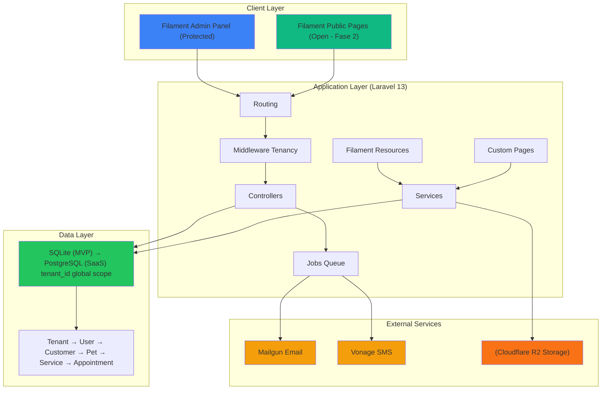

# PawDesk — Product Requirements Document (PRD)

> **Versione**: 1.6
> **Data**: 24 Aprile 2026
> **Status**: Draft
> **Stakeholder**: Team di sviluppo PawDesk

---

## 1. Executive Summary

### Problem Statement

I saloni di toelettatura gestiscono oggi la propria operatività con strumenti eterogenei (agenda cartacea, spreadsheet, WhatsApp, sistemi di prenotazione generici) che comportano:
- Perdita di tempo nella gestione manuale di appuntamenti e notifiche (stimato 2-3 ore/giorno)
- Tasso elevato di no-show (15-20% media del settore) per mancanza di reminder automatizzati
- Disconnessione tra anagrafiche clienti/storico trattamenti e agenda operativa
- Impossibilità di offrire un portale di prenotazione self-service professionale 24/7

### Proposed Solution

PawDesk è un gestionale multi-tenancy cloud-native per saloni di toelettatura che:
- Centralizza anagrafiche (clienti, animali, servizi) e agenda in un unico pannello
- Automatizza notifiche multicanale (email, WhatsApp, SMS) per conferme e reminder
- Offre un portale pubblico di prenotazione self-service con magic link authentication
- Genera automaticamente storico trattamenti con reportistica per il re-engagement

### Success Criteria (KPIs)

| Metrica | Target atteso | Metodo di misurazione |
|---------|---------------|----------------------|
| **Riduzione tempo gestione agenda** | -60% (da 2-3h a <1h/giorno) | Time-tracking operazioni nel pannello |
| **Tasso di no-show** | -50% (da 15-20% a <8%) | % appuntamenti stati NO_SHOW su totali |
| **Tasso conversione richieste** | ≥75% (da RICHIESTO a CONFERMATO) | Conversion funnel nel dashboard |
| **Soddisfazione clienti finali** | ≥4.5/5 | Feedback post-appuntamento via portale |
| **Adozione portale self-service** | ≥60% prenotazioni via portale | % prenotazioni provenienti da portale pubblico |
| **Uptime SLA** | ≥99.5% | Monitoring infrastrutturale |

---

## 2. User Experience & Functionality

### 2.1 User Personas

#### Primary: Toelettatore / Admin Salone
- **Profilo**: Proprietario o manager del salone, tecnicamente proficienti livello base-intermedio
- **Obiettivi**: Gestire efficientemente agenda, clienti, notifiche; avere visibilità sul business
- **Pain points**: Perdere tempo su operazioni manuali, dimenticare reminder, avere dati sparsi

#### Secondary: Cliente Finale (Proprietario Animale)
- **Profilo**: Utente consumer, vari livelli di digital literacy
- **Obiettivi**: Prenotare facilmente, ricevere conferne/reminder, vedere storico trattamenti del proprio animale
- **Pain points**: Difficoltà a prenotare fuori orario lavorativo, mancanza di reminder, mancanza storico

#### Tertiary: Toelettatore Dipendente
- **Profilo**: Operatore che esegue i trattamenti
- **Obiettivi**: Vedere i propri appuntamenti, accedere allo storico animali, registrare trattamenti
- **Pain points**: Informazioni sparse, mancanza contesto sull'animale (comportamento, note sanitarie)

### 2.2 User Stories

#### US1: Gestione Anagrafica Clienti
**As a** toelettatore/admin
**I want to** gestire l'anagrafica completa dei clienti
**So that** posso avere tutte le informazioni necessarie per il servizio e il contatto

**Acceptance Criteria**:
- [ ] CRUD completo su Cliente: nome, cognome, email, telefono, indirizzo
- [ ] Selezione canale di comunicazione preferito: Email / WhatsApp / SMS
- [ ] Tracciamento invio informativa privacy con timestamp (`gdpr_policy_sent_at`)
- [ ] Consenso esplicito marketing con timestamp (`marketing_consent_at`, opzionale)
- [ ] Preferenze cliente in campo JSON (`preferences`): versione policy, opzioni reminder, lingua
- [ ] Campo note libere (max 1000 caratteri)
- [ ] Vista aggregata: elenco animali collegati, storico appuntamenti, spesa totale
- [ ] Validazione email unica per tenant
- [ ] Ricerca full-text su nome, cognome, email, telefono

#### US2: Gestione Anagrafica Animali
**As a** toelettatore/admin
**I want to** gestire la scheda completa di ogni animale
**So that** posso personalizzare il trattamento in base a caratteristiche e esigenze specifiche

**Acceptance Criteria**:
- [ ] CRUD completo su Animale: nome, specie, razza, sesso, data di nascita (o età stimata)
- [ ] Upload foto profilo ( Cloudflare R2, max 5MB, formati JPG/PNG/WEBP)
- [ ] Selezione taglia: toy / piccolo / medio / grande / gigante (influenza il prezzo)
- [ ] Tipo pelo (coat): raso / corto / frangiato / frangiato_spaniel / primitivo / da_muta / riccio / liscio / pelo_lungo / pelo_corto (determina i servizi disponibili)
- [ ] Note comportamentali (campo libero, es. aggressivo con altri cani, ansioso al phon)
- [ ] Note sanitarie: allergie, patologie, farmaci in corso
- [ ] Visualizzazione ultimo trattamento eseguito + prossimo consigliato
- [ ] Associazione 1:N (1 cliente → N animali)

#### US3: Gestione Servizi e Listino
**As a** toelettatore/admin
**I want to** definire i servizi offerti con relativi prezzi e durate
**So that** il sistema può calcolare automaticamente durata e costo degli appuntamenti

**Acceptance Criteria**:
- [ ] CRUD su Servizio: nome, descrizione, categoria (es. bagno, taglio, trattamenti speciali)
- [ ] Durata stimata in minuti (utilizzata per il calcolo slot)
- [ ] Prezzo base
- [ ] Matrice override prezzi per taglia (toy/piccolo/medio/grande/gigante)
- [ ] Tipo pelo destinatario (`coat`): filtra servizi compatibili con il tipo pelo dell'animale (NULL per servizi indipendenti dal pelo)
- [ ] Flag "servizio componibile" (es. bagno + taglio possono essere abbinati nello stesso appuntamento)
- [ ] Stato: attivo / archiviato (i servizi archiviati non appaiono nelle prenotazioni ma rimangono nello storico)
- [ ] Visualizzazione in lista con ordinamento per categoria e nome

#### US4: Gestione Agenda e Appuntamenti
**As a** toelettatore/admin
**I want to** gestire gli appuntamenti attraverso una vista calendario interattiva
**So that** posso avere visibilità immediata sulla programmazione e allocare le risorse

**Acceptance Criteria**:
- [ ] Vista calendario giornaliera e settimanale (via `speniti/filament-calendar`)
- [ ] Creazione appuntamento con: cliente, animale (dropdown filtrato per cliente), toelettatore assegnato, data, ora, servizi multipli
- [ ] Calcolo automatico durata totale = somma durate servizi selezionati
- [ ] Calcolo automatico prezzo totale = somma prezzi (applicando matrice taglia animale)
- [ ] Stato appuntamento: RICHIESTO → CONFERMATO → IN_CORSO → COMPLETATO, con branch CANCELLATO/NO_SHOW
- [ ] Note interne (visibili solo a staff, non al cliente)
- [ ] Drag & drop per spostamento appuntamento (con conferma)
- [ ] Blocco slot manuale (ferie, pause, indisponibilità)
- [ ] Assegnazione colori diversi per stato appuntamento

#### US5: Portale Prenotazione Pubblica
**As a** cliente finale
**I want to** prenotare un appuntamento autonomamente online
**So that** posso prenotare 24/7 senza dover chiamare il salone

**Acceptance Criteria**:
- [ ] URL pubblico dedicato per tenant: `pawdesk.app/[slug-salone]`
- [ ] Flusso prenotazione step-by-step:
  1. Selezione servizio (con visualizzazione prezzo)
  2. Selezione animale (se cliente registrato) o inserimento dati animale
  3. Selezione data (mostrando solo date con disponibilità)
  4. Selezione slot orario disponibile
  5. Inserimento dati cliente (se non registrato) o login via magic link
  6. Conferma e invio richiesta
- [ ] La richiesta entra in stato `RICHIESTO` (non automaticamente confermata)
- [ ] Accesso cliente tramite magic link (Laravel Signed Routes) inviato via email o SMS
- [ ] Personalizzazione branding (logo, colori) per tenant
- [ ] Mobile-responsive design

#### US6: Notifiche Automatizzate
**As a** toelettatore/admin
**I want to** configurare e inviare automaticamente notifiche ai clienti
**So that** riduco il tasso di no-show e miglioro l'esperienza cliente

**Acceptance Criteria**:
- [ ] Configurazione template per evento × canale (Email, WhatsApp, SMS)
- [ ] Eventi supportati:
  - Richiesta ricevuta
  - Appuntamento confermato
  - Appuntamento rifiutato
  - Reminder 24h prima
  - Reminder 1h prima
  - Appuntamento completato
  - Re-engagement (es. dopo 30gg dall'ultimo appuntamento)
- [ ] Variabili nei template: `{{cliente.nome}}`, `{{animale.nome}}`, `{{data}}`, `{{ora}}`, `{{servizi}}`, `{{salone.nome}}`
- [ ] Rispetto preferenza canale del cliente (se selezionata, altrimenti fallback)
- [ ] Invio via queue (database driver in MVP, Redis in SaaS)
- [ ] Tracking stato invio (pending/sent/failed) per retry

#### US7: Storico Trattamenti
**As a** toelettatore/admin
**I want to** generare automaticamente lo storico dei trattamenti eseguiti
**So that** ho memoria di quanto fatto per ogni animale e posso fornire riferimento al cliente

**Acceptance Criteria**:
- [ ] Generazione automatica record trattamento alla chiusura appuntamento (stato COMPLETATO)
- [ ] Campi: servizi eseguiti, durata effettiva (editabile), prezzo finale applicato (editabile), note post-trattamento
- [ ] Upload foto prima/dopo (Cloudflare R2, max 3 foto, max 5MB cadauna)
- [ ] Campo prodotti utilizzati (testo libero in v1, strutturato in v2)
- [ ] Flag "visibile al cliente" (per decidere quali note mostrare nel portale)
- [ ] Visualizzazione in timeline nella scheda animale

#### US8: Impostazioni Salone
**As a** toelettatore/admin
**I want to** configurare orari, slot e credenziali notifiche
**So that** il sistema si adatta al mio modo di lavorare

**Acceptance Criteria**:
- [ ] Configurazione orari apertura per giorno della settimana (es. Lun-Ven 9-18, Sab 9-13)
- [ ] Durata slot prenotazione (default 30 min, editabile)
- [ ] Buffer tra appuntamenti (default 15 min, editabile)
- [ ] Giorni di chiusura / ferie (range date)
- [ ] Upload logo e selezione colori per portale pubblico
- [ ] Configurazione credenziali notifiche:
  - Resend API key (email)
  - Twilio SID + Auth Token (WhatsApp + SMS)
- [ ] Configurazione messaggi di assenza/out-of-office

#### US9: Reportistica e Dashboard
**As a** toelettatore/admin
**I want to** visualizzare report e metriche sul mio business
**So that** posso prendere decisioni data-driven

**Acceptance Criteria**:
- [ ] Dashboard con widget:
  - Fatturato del periodo (giorno/settimana/mese/anno)
  - Numero appuntamenti per stato
  - Clienti nuovi vs ricorrenti
  - Servizi più richiesti
  - Tasso di no-show
- [ ] Report dettagliato clienti/animali inattivi da X giorni (base per campagne re-engagement)
- [ ] Export in CSV/PDF dei report
- [ ] Grafico andamento prenotazioni negli ultimi 6 mesi

### 2.3 Non-Goals (Out of Scope v1.0)

- [ ] Gestione pagamenti (non è richiesto in v1, si può aggiungere in seguito)
- [ ] Gestione magazzino prodotti (complessità aggiuntiva non essenziale)
- [ ] App mobile nativa (il portale web è sufficiente e più veloce da implementare)
- [ ] Multi-lingua (v1 solo italiano, internazionalizzazione in seguito)
- [ ] Sistema di loyalty/punti (funzionalità marketing nice-to-have)
- [ ] Integrazione con calendari esterni (Google Calendar, etc.)
- [ ] Videochiamata per consulenze pre-appuntamento

---

## 3. Technical Specifications

### 3.1 Architecture Overview

### 3.2 Technology Stack

| Component | Technology | Versione | Note |
|-----------|-----------|----------|------|
| Backend Framework | Laravel | 13.x | PHP 8.4+ |
| Admin Panel | Filament | 5.x | Native multi-tenancy |
| Public Pages | Filament Custom Pages | 5.x | Public booking portal (Fase 2) |
| Multi-tenancy | Filament Native | 5.x | Single DB, `tenant_id` column |
| Calendar Widget | speniti/filament-calendar | - | Plugin custom, repo: https://github.com/speniti/filament-calendar |
| Database (MVP) | SQLite | 3.x | File-based, zero ops. Migrazione a PostgreSQL in fase SaaS |
| Database (SaaS) | PostgreSQL | 16.x | Single database con global scope, pg_trgm per full-text search |
| Queue Driver (MVP) | Database | - | Via Laravel Queue |
| Queue Monitoring | - | - | Rimandato a fase SaaS (Horizon) |
| Email Service | Mailgun | - | Free tier 100 email/day (3.000/month) |
| Messaging Service | Vonage | - | SMS API per notifiche e reminder |
| Media Storage | Cloudflare R2 | - | Foto animali, trattamenti |

### 3.3 Integration Points

#### Mailgun (Email)
- **Endpoint**: `POST https://api.mailgun.net/v3/{domain}/messages`
- **Auth**: API Key (`MAILGUN_API_KEY`)
- **From address**: Configurabile per tenant (es. `noreply@nomesalone.pawdesk.app`)
- **Rate limit**: Free tier 100 email/day (3.000/month), pay-as-you-go $0.10/1.000 email dopo

#### Vonage (SMS)
- **SMS API**: Vonage Messages API
- **Auth**: API Key (`VONAGE_API_KEY`) + API Secret (`VONAGE_API_SECRET`)
- **From number**: Configurabile per tenant (sender ID o numero virtuale)
- **Pricing Italia**: ~€0.00466/SMS outbound

#### Cloudflare R2 (Media Storage)
- **SDK**: Flysystem R2 adapter
- **Bucket structure**: `/tenant/{tenant_id}/animali/{animale_id}/...`
- **CDN**: Cloudflare CDN pubblico per accesso pubblico (foto profilo animali, prima/dopo)
- **Presigned URLs**: Per upload diretto client-side (ottimizzazione bandwidth)

### 3.4 Security & Privacy

#### Autenticazione e Autorizzazione
- **Admin Panel**: Laravel Fortify + Filament auth, roles via spatie/laravel-permission
- **Portale Pubblico**: Magic link authentication (Laravel Signed Routes), no password
- **Multi-tenancy isolation**: Global scope su tutti i Model per garantire `tenant_id`

#### GDPR Compliance
- **Informativa privacy**: Invio automatico via email alla creazione cliente, tracciato con `gdpr_policy_sent_at` (nullable fino a conferma invio)
- **Consenso marketing**: Opzionale, timestamp `marketing_consent_at`, separato dall'obbligo informativo
- **Preferenze cliente**: Campo JSON `preferences` per versione policy, opzioni reminder e altre preferenze
- **Base giuridica**: Dati anagrafici e promemoria servizio trattati come esecuzione contratto (Art. 6.1.b), consenso esplicito richiesto solo per comunicazioni di marketing
- **Data retention**: Configurabile, default 5 anni per anagrafiche, 10 per trattamenti
- **Right to erasure**: Endpoint per cancellazione completa cliente + cascade su animali/storico
- **Data export**: Endpoint per export completo dati cliente in JSON/CSV (RTBF)

#### Best Practices
- Tutti i token e API keys in env criptato
- HTTPS obbligatorio (Let's Encrypt automatico)
- SQL Injection prevention: Eloquent ORM + prepared statements
- XSS prevention: Filament e Livewire con sanitization automatica
- CSRF protection su tutti i form

---

## 4. Risks & Roadmap

### 4.1 Phased Rollout

#### Fase 1 — MVP (Core Interno)
**Obiettivo**: Gestional completo per uso interno del salone pilota
**Timeline**: 4-6 settimane

**Feature**:
- [ ] Setup Laravel 13 + Filament 5
- [ ] Struttura multi-tenancy nativa (single DB, tenant_id)
- [ ] Migrazioni complete: Tenant → User → Cliente → Animale → Servizio → Appuntamento
- [ ] CRUD completo nel pannello Filament
- [ ] Vista calendario con `speniti/filament-calendar`
- [ ] Notifiche email via Mailgun (queue database driver)
- [ ] Notifiche SMS via Vonage per reminder e conferme
- [ ] Generazione automatica storico trattamenti

**Non inclusi**: Portale pubblico, WhatsApp, magic link

#### Fase 2 — Portale Pubblico
**Obiettivo**: Abilitare prenotazione self-service 24/7
**Timeline**: +2-3 settimane (ridotto grazie a Filament Custom Pages)

**Feature**:
- [ ] Portale prenotazione via Filament Custom Pages (routing `/booking/{tenant_slug}`)
- [ ] Flusso richiesta → conferma/rifiuto
- [ ] Magic link per accesso cliente (Filament native auth)
- [ ] Notifiche SMS via Vonage per conferme e reminder
- [ ] Personalizzazione branding (logo, colori, layout custom)

**Vantaggi architettura Filament:**
- Single codebase con admin panel
- Stesso multi-tenancy, stesse models, stesse services
- Auth semplificata (magic link nativo)
- Deploy e manutenzione semplificati

#### Fase 3 — Intelligence
**Obiettivo**: Dashboard, reportistica e re-engagement
**Timeline**: +2-3 settimane

**Feature**:
- [ ] Foto prima/dopo (Cloudflare R2)
- [ ] Reminder automatici di re-engagement
- [ ] Reportistica e dashboard con grafici
- [ ] Export dati (CSV/PDF)

#### Fase 4 — SaaS
**Obiettivo**: Abilitare onboarding multi-salone
**Timeline**: +4-6 settimane

**Feature**:
- [ ] Onboarding self-service per nuovi saloni
- [ ] Piani abbonamento (Laravel Cashier + Stripe)
- [ ] Subdomain per tenant (`nomesalone.pawdesk.app`)
- [ ] Migrazione database: SQLite → PostgreSQL (multi-tenant, pg_trgm, concorrenza)
- [ ] Migrazione a Redis + Horizon per le code
- [ ] Sistema di pagamento incorporato

### 4.2 Technical Risks

| Rischio | Impatto | Probabilità | Mitigazione |
|---------|---------|-------------|-------------|
| **Performance single DB** | Alto se >100 tenant | Media | SQLite sufficiente per MVP (singolo salone); migrazione a PostgreSQL con indici su tenant_id in fase SaaS, preparare strategia sharding per il futuro |
| **Vonage API limits** | Medio | Bassa | Implementare rate limiting e retry con backoff esponenziale |
| **Cloudflare R2 downtime** | Medio | Bassa | Cache locale temporanea, monitoraggio status |
| **Filament 5 stability** | Alto | Media | Essendo versione major, mantenere aggiornamenti frequenti e testare su staging |
| **speniti/filament-calendar compatibility** | Medio | Media | Verificare compatibilità con Filament 5 prima dello sviluppo, preparare fallback con widget custom |
| **Magic link deliverability** | Medio | Media | Supporto dual-channel (email + SMS) per riduzione failure rate |
| **SQLite lock contention** | Medio | Bassa | Singolo worker per le code in MVP, nessun accesso concorrente significativo per singolo salone. Migrazione a PostgreSQL in fase SaaS risolve il problema |

### 4.3 Cost Estimation (MVP - Singolo Salone)

| Servizio | Costo Mensile | Note |
|----------|---------------|------|
| Hosting (Hetzner VPS 2vCPU) | €5-6 | Cost-optimized (CPX21) |
| Database (SQLite) | **€0** | File-based, zero ops, nessun container aggiuntivo |
| Cloudflare R2 | €0-5 | Prima 10GB gratuiti, poi ~$0.015/GB |
| Mailgun Email | €0 | Free tier 100 email/day (3.000/mese) |
| Vonage SMS | ~€0.70 | Stimato per 150 SMS/mese (€0.00466/SMS) |
| Dominio + SSL | €1-2 | .app domain, Let's Encrypt gratis |
| **Totale stimato** | **~€7-14/mese** | Per singolo salone |

**Nota**: WhatsApp rinviato a fase SaaS per ridurre complessità e costi iniziali. Gli SMS offrono copertura 100% dei telefoni.

**Strategia Database**:
- **MVP (Fase 1-3)**: SQLite — zero ops, sufficiente per singolo salone pilota. Full-text search via `LIKE` (volume dati basso, nessuna feature DB-specifica necessaria).
- **SaaS (Fase 4)**: Migrazione a PostgreSQL — necessaria per concorrenza multi-tenant, `pg_trgm` per fuzzy matching, supporto queue worker multipli. Laravel migrations rendono il passaggio trasparente a livello applicativo.
- **Ricerca avanzata**: Se in futuro servisse search cross-tenant o autocomplete complesso, Laravel Scout astrae il driver (Meilisearch/Typesense) senza riscrivere codice applicativo. Per il volume per-tenant previsto (centinaia di record), PostgreSQL nativo è sufficiente.

**Breakdown Hetzner CPX21**:
- 2 vCPU (Intel Xeon o AMD EPYC)
- 4 GB RAM
- 40 GB NVMe SSD
- €5.60/mese (location Helsinki/Falkenstein)

**Costo SaaS**: In fase SaaS, i costi verranno distribuiti su più tenant e si aggiungerà il markup per il margine.

### 4.4 Open Questions (To be resolved)

- [ ] **Struttura esatta Filament 5 multi-tenancy**: Verificare documentazione Filament 5 per panel provider, middleware, scope
- [ ] **Integrazione speniti/filament-calendar**: Struttura eventi, gestione slot, drag & drop
- [ ] **NotificationTemplate versioning**: Come gestire aggiornamenti template senza perdere personalizzazioni tenant?
- [ ] **GDPR data retention strategy**: Implementare soft delete o hard delete con backup?
- [ ] **SaaS pricing**: Definire piani, limiti per piano, trial duration, pricing features
- [ ] **Filament Custom Pages customization**: Livello di personalizzazione UI possibile per portale pubblico consumer-friendly
- [ ] **WhatsApp provider per SaaS**: Valutare se aggiungere WhatsApp in fase SaaS e con quale provider (Vonage, 360dialog, altri)

---

## 5. Appendice

### 5.1 Glossario

- **Tenant**: Singolo salone/istanza cliente (multi-tenancy)
- **Magic link**: Link firmato crittograficamente che autentica l'utente senza password
- **Customer Service Window (CSW)**: Finestra 24h in cui WhatsApp permette invio messaggi gratuiti se il cliente ha iniziato la conversazione
- **No-show**: Cliente che non si presenta all'appuntamento senza preavviso
- **Toelettatore**: Operatore che esegue i trattamenti sugli animali
- **Portale pubblico**: Frontend self-service per prenotazione clienti

### 5.2 Riferimenti

- Documento decisioni di progetto: `/home/simo/Code/pawdesk/pawdesk-decisions.md`
- Repository calendar widget: https://github.com/speniti/filament-calendar
- Filament 5 Documentation: https://filamentphp.com/docs/5.x/panels
- Mailgun Documentation: https://documentation.mailgun.com/
- Vonage SMS API: https://developer.vonage.com/en/messaging/sms

---

**Approvato da**: _________________ **Data**: _________________

**Revisione**:
- v1.0 (21 Apr 2026) - Creazione iniziale
- v1.1 (21 Apr 2026) - Rimozione sezione Data Model (affrontata in documento dedicato)
- v1.2 (23 Apr 2026) - Aggiornamento provider notifiche: Mailgun (email) + Vonage (SMS), rimozione WhatsApp da MVP, riduzione costi da €60-80 a €40-55/mese
- v1.3 (23 Apr 2026) - Semplificazione architettura: portale pubblico via Filament Custom Pages invece di Livewire standalone, riduzione timeline Fase 2 da 3-4 a 2-3 settimane
- v1.4 (23 Apr 2026) - Correzione costi: PostgreSQL self-hosted (€0), Hetzner CPX21 (€5-6/mese), totale da €40-55 a €7-14/mese
- v1.5 (24 Apr 2026) - Database MVP: SQLite al posto di PostgreSQL per semplificare stack e ops. Migrazione a PostgreSQL pianificata in Fase 4 (SaaS). Strategia search: LIKE per MVP, pg_trgm per SaaS, Laravel Scout come escape hatch per search engine dedicato
- v1.6 (24 Apr 2026) - Allineamento con data model v1.2/v1.3: GDPR ridesign (gdpr_policy_sent_at + marketing_consent_at + preferences JSON), taglie rinominate (toy/piccolo/medio/grande/gigante), tipo pelo unificato in singolo enum coat su pets e services, aggiunto filtraggio servizi per tipo pelo
